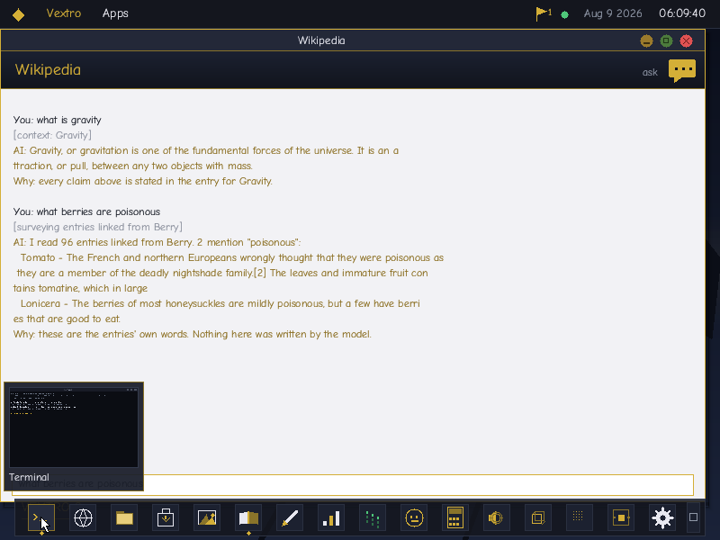
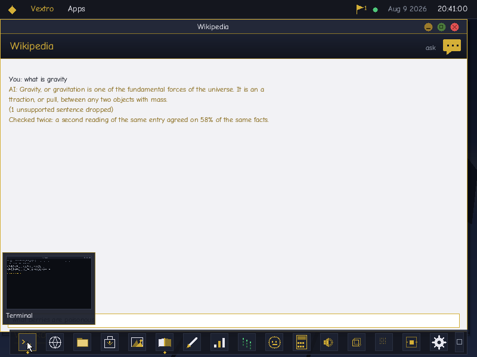

<h1 align="center">Vextro 9</h1>

<p align="center">
  <b>A desktop operating system written from nothing.</b><br>
  No libc. No kernel to fork from. No graphics library, no font renderer,<br>
  no network stack, no decompressor, no inference runtime — all of it is in this repository.
</p>

<p align="center">
  
  
  
  
  <a href="../../releases"></a>
  
  <a href="https://github.com/mrcalmtuber/vextro-arm64"></a>
</p>

<p align="center">
  
</p>

> **There is an ARM64 port** —
> **[vextro-arm64](https://github.com/mrcalmtuber/vextro-arm64)**.
> Same desktop, same browser, same Wikipedia, same language model, on
> aarch64: virtio devices, a GICv2 and the generic timer instead of the PIC
> and the PIT, and Raspberry Pi 4 drivers. On Apple silicon it runs under
> hardware virtualisation rather than emulation, which is the difference
> between a language model answering in seconds and in minutes. That
> repository documents the machine layer; this one documents the system.

---

## Building it

A bare-metal kernel cannot be built with the compiler that targets your
own operating system, so this needs an **`x86_64-elf` cross toolchain**.
On macOS that is four Homebrew formulae:

```
brew install x86_64-elf-gcc x86_64-elf-binutils xorriso qemu
```

On Linux, `xorriso` and `qemu-system-x86` are packaged everywhere; the
cross toolchain generally is not, and `gcc-x86-64-linux-gnu` is *not* a
substitute — it targets Linux rather than bare metal. Build one, or, if
your host toolchain already emits ELF, `make CC=gcc LD=ld` may do.

`python3` builds the disk images and fetches the assets. Nothing else is
needed — the boot animation is computed by the kernel rather than decoded
from a video, so there is no ffmpeg and no media file in the repository.
`make` names everything missing at once rather than stopping at the first
one.

You will want about **11 GB free**: an 8 GB sparse volume plus 1.4 GB of
downloads.

```
git clone https://github.com/mrcalmtuber/vextro
cd vextro
make            # builds the ISO and the 8 GB volume
make run
```

The first build offers to fetch the two things the repository cannot
carry: **Simple English Wikipedia** (~980 MB) and a **Qwen2 0.5B**
language model (~380 MB). GitHub refuses any file over 100 MB, so they are
downloaded from Kiwix and Hugging Face and written into `disk.img`.

Both are optional and the download never fails the build:

```
make ASSETS=1     # take them without asking (what CI wants)
make ASSETS=0     # skip entirely
make assets       # fetch later, or after saying no
```

Without them the system still boots and runs — the Wikipedia window
reports no archive, and the prompt after login has nothing to offer. Say
no now and `make assets` later, and the next `make` notices and rebuilds
the volume around them; nothing has to be cleaned by hand.

---

## The short version

It boots on a real machine, draws a windowed desktop with anti-aliased type,
talks to the internet over its own TCP/IP stack, reads a complete offline
Wikipedia, installs applications from a package store, and **runs a
transformer language model on the CPU** — all with no operating system
underneath it and no C library beside it.

Every layer that a normal application takes for granted had to be built
first. There is a TrueType rasteriser because there was no way to draw a
letter. There is a Zstandard decompressor because Wikipedia archives are
compressed with it. There is an NVMe driver because a modern machine has
nowhere else to keep a 900 MB encyclopedia.

---

## First light

<p align="center">
  
</p>

**The boot animation is not a video.** The dragon off the desktop wallpaper
draws breath and sets fire to the screen, the screen burns away to nothing,
and then you log in.

It is the same dragon. `wall_dragon()` takes a centre and a scale, so the
wallpaper draws it full size in the middle and the boot draws it half size
and left of centre, from one set of polygons — rather than a second dragon
that has to be kept in step with the first.

Two fields do the work, and they are deliberately different mechanisms
because they are different things:

**The fire is advected.** Each cell pulls heat from the cell to its left and
the ones below, so the flame streams away from the mouth and rises. The mix
shifts over the sequence: the jet leaves the mouth almost flat, and once the
breath stops what is left of it stands up and gutters out.

**The burn is a front.** Fire is not what destroys the screen — what fire
leaves behind is — so the char is a separate field that ignites where the
jet lands and then eats outward on its own, ember rim ahead of cold char. It
spreads in a distance metric squashed hard downrange, so it runs out ahead
of itself the way the breath went; a front that spreads evenly is a circle,
and a circle expanding out of a dragon's mouth reads as a shockwave rather
than as something catching light.

Neither needs a square root. The front compares squared distance against a
squared radius, perturbed per cell by a tiled noise field, which is what
makes its edge ragged. Integer throughout, on the same 360-entry sine table
the login screen uses, because this runs *before* the floating-point unit is
switched on — before the interrupt table exists, before a single driver has
been probed.

It used to be a recording, and recordings are heavy: 121 frames of 320×240
RGB565 is **18.5 MB of raw pixels**, linked into the kernel *and* copied into
the ISO, generated from a 6.8 MB `.mp4` by ffmpeg — a build dependency
nothing else here needed.

| | before | after |
|---|---:|---:|
| ISO | 40 MB | **4.6 MB** |
| in the repository | 6.8 MB of video | **none** |
| ffmpeg | required | **not used at all** |

`src/bootanim.h` is 373 lines and byte-identical on both architectures.

---

## What it looks like

<table>
<tr>
<td width="50%"></td>
<td width="50%"></td>
</tr>
<tr>
<td><b>Shell</b> — a real filesystem, and <code>ping</code> and
<code>fetch</code> going out over a TCP/IP stack that is 1,200 lines of
this repository.</td>
<td><b>Browser</b> — <code>info.cern.ch</code>, the first website, fetched
and rendered on bare metal. HTTP only: there is no TLS, because there are
no secrets on a machine with no users.</td>
</tr>
<tr>
<td></td>
<td></td>
</tr>
<tr>
<td><b>Offline Wikipedia</b> — live prefix search across
<b>399,853 entries</b>, answered by binary search over the archive's sorted
path list. About twenty reads, and it barely slows as the archive grows.</td>
<td><b>Articles</b> render in the Wikipedia window itself, through a
layout engine with a run-based line model — so a sentence full of links
stays one sentence. Internal links resolve back into the archive, and Back
restores your reading position.</td>
</tr>
<tr>
<td></td>
<td></td>
</tr>
<tr>
<td><b>Ingot</b> — the app store. It lists every application on the
machine, built-in and installable alike, so the storefront answers "what
is on this machine" and not merely "what else could be". Install writes a
validated payload to the system volume and records it in a registry, so
installed apps survive a reboot.</td>
<td><b>…and they run.</b> Installed apps join the dock and open in their own
window. This Mandelbrot is 16.16 fixed point — the kernel is compiled with
no FPU at all.</td>
</tr>
<tr>
<td></td>
<td></td>
</tr>
<tr>
<td><b>Solid</b> — 3D through <code>g3d</code>. The panel is the API
reporting on itself: which backend is live, how many triangles survived
culling, how many fragments were shaded, and the compiled size of the
shader running them.</td>
<td><b>Chamber</b> — a guest on AMD-V. The green line was written by
guest code storing to <code>0xB8000</code>, translated by nested page
tables; every exit in the log is a real VMEXIT at an address that matches
the disassembly.</td>
</tr>
<tr>
<td></td>
<td></td>
</tr>
<tr>
<td><b>Photos</b> — a custom image format: PNG-style row prediction filters
over an LZMA stream. The status bar is not marketing, it is the file:
<b>623 KB → 12 KB</b>.</td>
<td><b>Login</b> — real accounts. Salted SHA-256 iterated 4,096 times,
compared in constant time, with per-user home directories. A wrong
password melts the screen.</td>
</tr>
</table>

---

## The desktop

<table>
<tr>
<td width="50%"></td>
<td width="50%"></td>
</tr>
<tr>
<td><b>Peek and previews</b> — click the Show Desktop tab at the end of
the taskbar and every window fades towards what is behind it, leaving its
outline; click again, or click any window, to bring the stack back. It is
a latch, not a hover, so crossing the taskbar never dissolves your work.
The preview above a button is the window itself, captured out of the
compositor.</td>
<td><b>Snap</b> — drag a window to an edge and it takes half the work
area; drag it to the top and it fills it. The target is previewed while
the button is held, so the gesture can be abandoned.</td>
</tr>
<tr>
<td></td>
<td></td>
</tr>
<tr>
<td><b>Search</b> — type in the start menu and it looks through the
applications, the things each app was recently pointed at, and the volume
itself, breadth-first under a budget so it cannot cost a frame.</td>
<td><b>Calculator</b> — three modes, and not one floating-point
instruction. Values are 64-bit integers scaled by a million, so 12.5 × 8
is exactly 100 and 1000 mm is exactly 1 m.</td>
</tr>
</table>

**Windows.** Minimize, maximize and snap share one saved rectangle rather
than three that could disagree. Shake a window — four direction changes
inside half a second, counting only strokes long enough not to be a hand
holding still — and everything else gets out of the way; shake it again
and the desk comes back.

**Taskbar.** Pinned launchers that become window buttons once something is
running: click the focused one to put it away, click again to bring it
back. Right-click opens a jump list of what that app was last pointed at.

**Gadgets.** A clock, a system meter and a network panel, drawn on the
desktop under the window stack. The CPU meter is fed by the render loop's
own cycle counters — a meter driven by a counter that ticks whether or not
anything is happening would be decoration, not instrumentation.

**Action Center.** A flag on the menubar with an unread count, and a panel
listing the last sixteen things the system did: signing in, an app being
installed, the language model being enabled, the network link changing.
Nothing in it steals focus or blocks.

**Power.** The render loop parks the core between frames rather than
spinning through them. After ninety seconds without a pointer move, click
or keystroke the screen fades down, and comes back four times as fast as
it went — once the fade settles every frame equals the last, so the flip's
row diff finds nothing to send to the panel.

---

## Security, and exactly what it is worth

**Encrypted containers.** `vault seal <dir> <file> <passphrase>` puts a
directory into one file: ustar, then ChaCha20 over the archive. The
header carries the salt and nonce in the clear — they are not secrets —
and a *verifier* that is not the key. That last part is the one that
matters. A stream cipher cannot tell a wrong key from a right one; it
decrypts to garbage either way. Without the verifier, a mistyped
passphrase would cheerfully write noise over a home directory and call it
a restore. It says `wrong passphrase` and writes nothing.

The cipher is ChaCha20 rather than AES for a reason specific to this
machine: it is add, xor and rotate on 32-bit words and nothing else. AES
without AES-NI means a table-driven implementation whose timing depends
on the key, which is worse than useless. It is checked against the
published RFC 8439 vectors, not against itself — an implementation that
is merely self-consistent round-trips perfectly and protects nothing.

**Backup and restore.** `backup <file> <passphrase>` seals this account's
home directory; `restore` puts it back. `make test` covers the cipher;
the round trip was exercised on the machine.

**Allow list, scanner, prompt levels.** Three settings in
`/etc/policy.cfg`, read before anything can be launched and enforced at
the single point every program passes through. A refusal is announced on
the serial line, in the terminal, and in the Action Center — a program
that simply fails to start, with no reason given, is indistinguishable
from a broken one. The scanner's signature list includes the EICAR
standard test string, which exists precisely so a scanner can be
demonstrated without keeping a real sample on the disk; what it is
genuinely good at is catching a binary altered since it was installed.

**What none of this is.** It decides whether a program starts. It does
not constrain one that is running, and it is not a kernel enforcement
boundary. That sentence is in the source, in the `policy` command's own
output, and here, because "login" and "scanner" are words that imply more
than this system delivers.

---

## Fuzzing the loader

`vx_validate()` is the only thing between a `.vx` payload downloaded over
plain HTTP and a loader that runs it with kernel privileges in a shared
address space, so it is fuzzed rather than trusted.

```sh
cd vxfmt/fuzz && make
AFL_MAP_SIZE=65536 afl-fuzz -i in -o out -m none -- ./harness @@
```

The harness calls `vx_validate()` and returns. It deliberately does not go
through `vx_run`'s `main()`, which after validating goes on to `mmap`,
`mprotect` and **call the image's entry point** — a fuzzer that reached
that would be executing attacker bytes rather than testing the check meant
to stop them.

Last run: **33,644 executions, 71.2% edge coverage, 100% stability, zero
crashes and zero hangs** under AddressSanitizer.

Two things that reading found and the fuzzer would not, both still open
and written up in `vxfmt/fuzz/README.md`:

- `vx_run.c` `malloc`s exactly `file_size` bytes and then unconditionally
  `memcpy`s 80 of them *before* validating, so any file of 1–79 bytes is a
  heap over-read. The kernel's own loader checks the size first — the two
  loaders disagree and the POSIX one is wrong.
- The import table is outside everything `vx_validate()` looks at.
  `vx_resolve_imports()` reads a `count` from the loaded image and walks
  that many entries; its bounds live in the resolver, not the validator.

---

## What is not here

Vextro is one person's operating system, and the honest list of what it
cannot do is longer than the list of what it can. These are the things
most often assumed to be present:

| | Why not |
|---|---|
| **Hardware-rasterised 3D** | There *is* a 3D API now — `src/g3d.h`: pipelines, buffers, matrices, a command buffer, and a shader language with a real compiler (see below). What no hardware here can do is run it: the Gen9 driver is a blitter by design and QEMU's display has no 3D engine, so geometry and fragment stages are CPU work and the backend dispatches only clears to the GPU. Solid reports which backend is live. |
| **H.264, AAC, DivX** | Compressed *audio* is here — FLAC, IMA ADPCM and G.711, in `src/flac.h` and `src/adpcm.h`. Compressed *video* is not: H.264 alone is months of work, and there is no video container, no frame scheduler and no colour-space conversion to hang it on. |
| **A hypervisor on ARM64** | x86 has one — `src/hyper.h` runs a guest on AMD-V with nested paging. The ARM64 port does not: it reaches EL2 only under TCG emulation with a VHE-capable core (HVF refuses to provide EL2 at all, and Limine panics on an ARMv8.0 one). The prerequisite is measured and reported rather than assumed; the hypervisor itself is not written. |
| **Enterprise networking** | `src/netstack.h` is ARP, IPv4, ICMP, UDP, DHCP, DNS and one TCP connection at a time. No VPN, no branch caching, no directory services. |
| **TLS** | No cryptographic transport, so `https://` is refused rather than faked. |
| **Full-disk encryption** | Individual directories can be sealed into encrypted containers (below); the volume itself is not encrypted, so filenames and free space are in the clear. |
| **Application sandboxing** | `.vx` applications run with full kernel privileges in a shared address space. The allow list and scanner decide whether a program *starts*; nothing constrains what it does once running. The account system buys identity and separate workspaces — it is **not** a security boundary, and the About panel says so. |
| **Device management, biometrics, multi-touch** | No hardware to drive: this configuration exposes no fingerprint reader and no touch digitiser. |
| **TV recording, media streaming to network devices** | No tuner driver, and no streaming protocol. |

---

## Things that are more interesting than they sound

### A language model, on the metal

`src/llm.c` is a complete transformer: byte-level BPE tokeniser, GGUF
parsing, dequantisation for every weight type the model uses, and the
forward pass. Drop a Qwen2 GGUF on the volume and the Wikipedia app grows a
chat panel that retrieves an article and answers from it.

<p align="center">
  
</p>

The prediction sharpens as context arrives — `The` → ` following`,
`The capital` → ` city`, `The capital of France` → ` is`, and then
**` Paris`**. That is a real forward pass, not a lookup: 24 layers, 14 query
heads over 2 key/value heads, a 151,936-token vocabulary, and 373 MB of
weights resident, on a machine with no libc and no GPU.

And it is not just predicting tokens in the abstract — the Wikipedia window
puts the whole thing together:

<p align="center">
  
</p>

Asked *what is photosynthesis*, it pulled the distinctive words out of the
question, binary-searched 399,853 sorted titles, read
`[context: Photosynthesis]` off a 980 MB archive, and answered from that
article — retrieval-augmented generation with no index, no database and no
network. The wording is the model's own, mangled grammar and all; a 0.5B
model running a token at a time on bare metal sounds like that, and tidying
it up here would misrepresent it.

That capture is from the **arm64** build under hardware virtualisation,
which is the honest reason the port exists. The same question on the x86_64
build under full emulation was still consuming the prompt five minutes
later.

The model loads **by itself, in the background**, while the desktop stays
live — there is nothing to type and nothing to wait for. Dequantisation is
checked against an independently written reference decoder for every type
the model uses, and `llm probe` compares intermediate tensors to the digit.

That check exists because of a bug worth recording. The model answered
fluent nonsense for a long time, and the suspicion was on K-quant
dequantisation — which this model does not use at all. Three of its
tensors are **Q5_1**, `quant_block` knew the type so the file loaded
cleanly, and `dequant_block` had no case for it, so every such block
returned −1 and the matmul quietly returned zero. All three are
`ffn_down`, in layers 0, 1 and 10. Layer 0 corrupts the residual stream
before anything else runs, which is exactly how you get logits that carry
no signal. Two tables disagreeing about which formats exist was the whole
defect; they agree now, and a type that is missing fails loudly at load
rather than silently at inference.

It is the one translation unit in the build allowed to touch the FPU.
Everything else is compiled `-mno-sse -mno-80387`, so no interrupt handler
can quietly acquire a floating-point dependency.

### A shader language, compiled at run time

`src/g3d.h` is the 3D API — pipelines, vertex and index buffers, matrices,
uniforms, a command buffer recorded and submitted as a frame — and the part
that makes it an API rather than a renderer is **G3SL**: a small language
with a real compiler. A tokeniser, a recursive-descent parser with operator
precedence, static type checking over scalars and `vec3`, and a stack
machine to run the result.

```
# a lambert term, and a rim light on the silhouette
d   = sat(dot(n, l));
rim = sat(1.0 - dot(n, e));
color = base * (0.18 + 0.82 * d) + gold * (rim * rim * 0.55);
```

Type errors are compile errors with a line number — `dot` of two scalars,
a `vec3` where a scalar belongs, a variable changing type — and the Solid
window prints the message rather than drawing something strange. Programs
compile from text at run time, so switching shaders visibly changes the
picture. Every value inside is 16.16 fixed point, because a float would
fail to link.

### A model trained here, to answer only from the archive

`assets/explain.gguf` is 135M parameters, fine-tuned in this repository
on 42,495 examples built out of the encyclopedia itself. Nothing in the
target text is invented, by construction — a dataset written by a larger
model would teach this one to sound like that model, including when it
is wrong.

Not trained from scratch, and the arithmetic is why. A 200M model wants
roughly four billion tokens to be worth its size; Simple English
Wikipedia is about three hundred million, and a properly-fed run is days
of compute. That produces a model *weaker* than the 0.5B it was meant to
improve on. Fine-tuning a well-trained small base on the exact task is
the version of this that works.

A fifth of the set is **refusals** — a question whose passage does not
answer it, with "Not in the archive." as the target. Without them a small
model learns that an answer is always available and produces one from
nowhere.

Measured on held-out examples:

| | grounded | refusal correct | token-F1 |
|---|---:|---:|---:|
| SmolLM2-135M, as downloaded | 35.0% | 26.1% | 0.318 |
| **fine-tuned here** | **77.0%** | **100.0%** | **0.993** |

The difference is the one that matters:

> **base** — "Don Sandburg was an American television writer, actor and producer. *He died at the age of 87.*" — the death invented
>
> **tuned** — "Don Sandburg (1930 – October 6, 2018) was an American television writer, actor, and producer."

In the kernel it answers in 20 seconds against the 0.5B's 43, at a
quarter the size. `llm use qwen2` switches back.

Running it needed one real fix. Rotary embeddings pair each dimension
with a partner, and there are two incompatible conventions: half-split
(`i` with `i + head_dim/2`, which qwen2 uses in GGUF) and interleaved
(`2i` with `2i+1`, which llama uses, because llama.cpp permutes the q and
k weights for it). Choosing wrong leaves attention working and the text
fluent while the numbers are wrong. It surfaced by running the kernel's
own transformer on the host — `tools/llm_infer_test.c` — and finding the
q projection to be the reference's values at every other position. With
the convention selected by architecture, every logit matches a reference
implementation to three decimals.

<p align="center">
  
</p>

### Both models, at once, checking each other

The two models are resident together — `llm.c` keeps everything that
belongs to *a* model in one struct and there are two of them, so
switching is an index rather than a reload. They share the arena, which
is what lets the second load continue where the first stopped instead of
overwriting it.

A question goes to both. The tuned model answers; the 0.5B answers the
same prompt, re-encoded, because its tokenizer is a different vocabulary
entirely. Then the deterministic verifier checks each against the entry,
and the transcript reports how much of the same ground they covered:

```
AI: Gravity, or gravitation is one of the fundamental forces of the
    universe. It is an attraction, or pull, between any two objects
    with mass.
(1 unsupported sentence dropped)
Checked twice: a second reading of the same entry agreed on 58% of
    the same facts.
```

The answer stands on its own. Nothing cites the entry it came from and
nothing names the models, because where an answer came from is a
property of how it was produced rather than part of what was said — and
a citation on every line turned two clauses into a paragraph of
provenance. The grounding is untouched: retrieval, the single-passage
rule and the verifier still decide whether there is an answer at all,
and every source is on the serial log for anyone auditing it.

What survives on screen is what the reader is owed regardless: that part
of the draft was discarded, and that a second reading did or did not
reach the same facts.

That run is a fair illustration of what the check is worth. The 0.5B
wrote "it keeps planets in orbit around their stars" — plausible, absent
from the passage, and dropped by the verifier rather than by the other
model. Agreement is not proof, because both can be wrong about the same
passage; **disagreement is the useful signal**, and it is reported rather
than resolved silently. `llm check off` turns it off; the answer then
comes from one reading in half the time.

<p align="center">
  
</p>

### A guest that runs on the processor

`src/hyper.h` is a type-1 hypervisor on AMD-V. Not an interpreter: the
guest's instructions execute natively and only what the host intercepts
traps back — CPUID, I/O, MSR access, HLT and the hypercall.

AMD-V rather than VT-x for a checkable reason. QEMU's TCG interpreter
implements SVM with nested paging and does not implement VMX at all:

```
query-cpu-model-expansion max  ->  svm = True, npt = True, vmx = False
```

so the AMD path is the one that can actually be run here, and the Intel
path would be code nobody could execute. The guest is 32-bit protected
mode with paging off — under nested paging it needs no page tables of its
own — and it gets one megabyte of guest-physical that the nested page
table maps and nothing else. It writes to a text screen at `0xB8000`,
makes hypercalls, reads the hypervisor CPUID leaf, and does an I/O write.

Every exit address in Chamber's log matches the disassembly: `VMMCALL` at
`0x1023`, `CPUID` at `0x1030`, `IOIO` at `0x104F` carrying port `0x3F8` in
`EXITINFO1`. NRIP-save is absent under TCG, so exits advance the
instruction pointer by known lengths and use the processor's next-RIP
where it provides one.

### A decoder you can check exactly

`src/flac.h` decodes FLAC: constant, verbatim, fixed and LPC subframes,
Rice partitions with both parameter widths and the raw escape, all four
channel decorrelations, 8/16/24 bits, with CRC-8 on each frame header and
CRC-16 on each frame. It is integer from end to end, which is why a
machine with no FPU can have it at all.

Lossless is the point. A lossy decoder can only be judged by ear; this one
is compressed with the reference encoder at its densest setting and the
samples must come back **identical**. Nine signals chosen to reach
different parts of the decoder — silence for constant subframes, a ramp
for the fixed predictors, noise for the Rice escape, correlated channels
for mid/side — all exact.

That caught a real bug: the Rice partitioning is defined over the whole
block, not over the residual. Sizing it over the residual is invisible at
partition order 0, which is what short frames use, and only appears once
an encoder picks a real partition order.

### Wikipedia, offline, from the raw archive

`src/zim.h` reads Kiwix ZIM files straight off the disk, a window at a
time — nothing is loaded whole, and only one decompressed cluster is ever
in memory. Since 2021 those archives are Zstandard, which meant writing
`src/zstd.h`: FSE/tANS, Huffman, sequence reconstruction with repeat
offsets, from RFC 8878. Older xz clusters work too, through a complete
LZMA2 decoder in `src/lzma.h`.

Verified against a real 937 MB Simple English dump: the kernel lands on the
same clusters and byte counts as a host-side reference run.

### Storage that works on hardware built this decade

Three buses, probed newest first: **NVMe**, **AHCI/SATA**, and legacy ATA
PIO. A machine bought in the last ten years has no IDE controller at all,
so without the first two the OS boots and finds nothing.

Two details that are easy to skip and expensive to get wrong:

- **Physical contiguity.** A DMA engine is handed physical addresses, and a
  buffer that is one array to C is one array to the device only if its
  pages happen to be adjacent. They are, under this bootloader — which is
  exactly how a driver works on the machine it was written on and corrupts
  memory on the next one. Buffers are resolved page by page and coalesced.
- **Block size.** NVMe namespaces are increasingly not 512 bytes, and every
  filesystem above expects that they are. The translation includes the
  read-modify-write a partial write needs; without it, writing one sector
  on a 4K drive destroys the seven either side, silently.

### Type, without a font library

`src/ttf.h` is an integer-only TrueType rasteriser — glyph outlines, 8×8
supersampled anti-aliasing, no floats and no GPU. Baselines and glyph
origins snap to whole pixels (leave them fractional and a 13px baseline
lands on a half-pixel and fringes every letter), and each glyph's coverage
mask is cached per size rather than re-rasterised every frame, which is
what makes the finer sampling affordable at 60 fps.

### Its own executable format

Store packages are `.vx` images: an 80-byte header, page-separated text
and data, no relocations. The same `vx_validate()` runs in the host
packer, the kernel loader and the store's download path — one validator,
three consumers, so a payload cannot be accepted by one and rejected by
another.

`vxfmt/vx_run.c` is a POSIX loader for the same format, which means an
image can be checked on your laptop before it is ever handed to the kernel.
Text and data never share a page, so `mprotect()` can give them different
protections and **W^X holds** — and on hosts with pages coarser than 4 KB
it refuses rather than silently mapping RWX.

### A GPU driver that reports its own failures

`src/igpu.h` drives the Intel Gen9 blitter: a private GGTT window, the BCS
ring in legacy submission mode, `XY_COLOR_BLT` packets, and a CPU-verified
self-test at boot. When a submission's breadcrumb never lands it latches
the i915-style error state — EIR/ESR, the exact command header that broke
the pipeline decoded by name, ACTHD, INSTDONE, GGTT faults, the ring
contents around the parse point — attempts an engine reset, and falls back
to CPU rendering after repeated hangs. `gpu error` prints the report.

---

## Try it

```sh
make          # builds the ISO and an 8 GB sparse exFAT system disk
make run      # QEMU, full screen, networking up
```

Pre-built ISOs are under [**Releases**](../../releases) if you would rather
not build a cross-compiler.

First boot asks you to choose a keycode; it is saved to the volume. Then:

```
open browser                    or click the globe in the dock
store install mandel            then look at the dock, and reboot
ping 10.0.2.2
fetch http://example.com
echo hello disk > hi.txt
mkdir projects && cp hi.txt projects/copy.txt
cat projects/copy.txt           still there after a reboot
```

**Just move the mouse.** The pointer is absolute — no click-to-grab, no
capture to escape. A PS/2 mouse can only report *relative* motion, which a
host cannot turn into a position without capturing the real cursor first,
so the guest asks for the VMware backdoor pointer and falls back to PS/2
only when there is no hypervisor to ask.

<details>
<summary><b>Building from source</b></summary>

| Tool | Why |
|------|-----|
| `x86_64-elf-gcc` / `x86_64-elf-ld` | Bare-metal cross toolchain |
| `xorriso` | ISO creation |
| `qemu-system-x86_64` | Running it |
| `python3` + `opencv-python` + `numpy` | Only if `boot.mp4` changes |

```sh
brew install x86_64-elf-gcc x86_64-elf-binutils xorriso qemu
pip3 install opencv-python numpy
make
```

`make` compiles the kernel, the userland app and the store packages (each
linked to ELF64 then repacked as `.vx`), converts the boot video to raw
RGB565 frames, assembles `os.iso`, and creates `disk.img` — an 8 GB sparse
exFAT volume seeded with the starter files, the package repository and the
sample pictures.

`disk.img` is created **once** and then left alone, so your files survive
rebuilds. `make cleandisk` resets it to factory contents.

The display mode is 1280x800 by default, up to the back buffer's bound:

```sh
make run RES=1920x1080x32
```

`disk.img` is a standard image — mount it on your host to exchange files
with the OS, including dropping in a multi-gigabyte archive:

```sh
hdiutil attach -imagekey diskimage-class=CRawDiskImage disk.img   # macOS
```

</details>

<details>
<summary><b>Serving the package repository over the network</b></summary>

The store's **Refresh** button queries an HTTP repository. To run one:

```sh
make repo
```

That stages and serves the compiled packages on port 8000. QEMU maps the
host to `10.0.2.2`, which is the store's default repository URL, so
**Refresh** just works — it picks up `voronoi`, which is deliberately *not*
on the disk, and installing it downloads the payload over the kernel's own
TCP stack.

Point it elsewhere with `store repo <url>`.

</details>

---

## What is actually in here

**32,146 lines of C**, no libc, compiled as a single translation unit plus
one for inference. (35,092 counting the embedded typeface and the integer
sine table, which are data rather than logic.)

| | |
|---|---|
| **Desktop** | Window manager with minimize, maximize, snap-to-edge, shake-to-clear and a latched Show Desktop peek; taskbar with live window previews and jump lists; desktop gadgets; start-menu search over apps, recent items and the volume; Action Center; five wallpaper themes with an optional slideshow; idle dimming |
| **Applications** | Terminal with 38 Unix commands, browser, file manager, offline Wikipedia reader, image viewer, paint, system monitor, app store, calculator, media player, 3D viewer, CHIP-8, hypervisor console, settings |
| **Audio** | AC97 bus-mastering playback; FLAC, IMA ADPCM and G.711 decoders, all integer |
| **3D** | `g3d`: pipelines, vertex and index buffers, matrices, a command buffer, and G3SL — a shader language with a tokeniser, precedence parser, type checker and stack machine |
| **Virtualisation** | AMD-V hypervisor on x86: VMCB, nested paging, and a 32-bit guest that runs on the processor |
| **Filesystem** | Read/write exFAT with 64-bit sizes, FAT32 fallback, ustar ramdisk, MBR partitions, range reads out of files too big to buffer |
| **Storage** | NVMe, AHCI/SATA, ATA PIO — behind one 512-byte sector view |
| **Network** | IPv4, ICMP, UDP, DNS, TCP, async HTTP/1.0 with redirects; Intel e1000 driver |
| **Graphics** | Integer TrueType rasteriser, Intel Gen9 blitter with hang capture, firmware framebuffer fallback |
| **Compression** | Zstandard (RFC 8878), LZMA/LZMA2/xz, both written from the specifications |
| **Inference** | GGUF parsing, BPE tokeniser, dequantisation, transformer forward pass |
| **Userland** | `.vx` container format, `int 0x80` syscall ABI, a package store, five shipped apps |
| **Accounts** | Multiple users, salted SHA-256 iterated 4,096 times compared in constant time, per-user home directories, administrator rights, logout that clears session state |
| **Audio** | AC97 bus-master playback out of a descriptor list, verified by capturing the guest's output to a WAV on the host and measuring it — 438.3 Hz against 440 requested |
| **3D** | Integer software rasteriser: 16.16 fixed point, perspective divide once per vertex, 1/z depth buffer, backface culling, flat shading from cross-product normals with a bit-by-bit integer square root |
| **Emulation** | A complete CHIP-8 interpreter — all 35 opcodes, 4 KB address space masked on every access, collision flag on sprite XOR |
| **Security** | ChaCha20 checked against the RFC vectors, encrypted containers with a passphrase verifier, ustar writer, encrypted backup and restore, per-account allow list, signature and structural scanner, prompt levels — all policy, none of it isolation |
| **Boot** | Limine, BIOS *and* UEFI, El Torito ISO; a boot animation the kernel computes rather than plays back — an advected fire simulation and a separate burn front, in integer arithmetic, before the FPU is even initialised |

<details>
<summary><b>Source layout</b></summary>

```
src/
  kernel.c      Entry point, render loop, login flow, syscalls
  desktop.h     Window manager, menu bar, dock, wallpaper, loader
  term.h        Terminal: commands, history, scrollback, redirection
  browser.h     HTML renderer, navigation, links
  apps.h        Files / Settings / Photos / Wikipedia + chat / About
  store.h       Ingot: catalog, installer, registry, storefront
  llm.h llm.c   Transformer inference (the one FPU translation unit)
                qwen2 and llama architectures, both rotary conventions
  zim.h         ZIM archive reader (offline Wikipedia)
  zstd.h        Zstandard decompressor
  lzma.h        LZMA / LZMA2 / xz decompressor
  sci.h         Compressed image format + decoder
  flac.h        FLAC decoder     adpcm.h  IMA ADPCM + G.711
  ac97.h        AC97 codec + bus-master playback
  media.h       Media Player: track list, transport, decode dispatch
  g3d.h         3D API + G3SL shader compiler   solid.h  its client app
  hyper.h       AMD-V hypervisor  chamber.h  the window onto it
  chip8.h       CHIP-8 interpreter
  ttf.h         TrueType rasteriser        gfx.h  Drawing primitives
  netstack.h    IPv4 / ICMP / UDP / DNS / TCP / HTTP
  e1000.h       Intel NIC driver
  blk.h         Block layer: one sector view over three buses
  nvme.h        NVMe: admin + I/O queues, PRP lists, 4K blocks
  ahci.h        AHCI/SATA: command lists, PRDT scatter/gather
  ata.h         ATA PIO + LBA48 (legacy fallback)
  exfat.h       exFAT read/write      fat32.h  FAT32 fallback
  pci.h         PCI enumeration, BAR sizing, MMIO mapper
  igpu.h        Intel Gen9 blitter + GPU hang capture
  keyboard.h    PS/2 keyboard         mouse.h  Pointer + wheel
  vmmouse.h     VMware backdoor (absolute pointer, no grab)
  xhci.h        USB HID — incomplete, off by default, honest about it
vxfmt/         The .vx executable format, its packer and a POSIX loader
apps/           Userland source, store packages, seed files, pictures
tools/          exFAT/FAT32 formatters, image and video converters,
                package repository server, QEMU test driver
limine-binary/  Pre-built bootloader
```

</details>

---

## License

Source released under the [Apache License 2.0](LICENSE).
Comic Neue is under the [SIL Open Font License 1.1](assets/OFL.txt).
Limine is [BSD 2-Clause](https://github.com/limine-bootloader/limine).

<p align="center"><sub>There is also an <a href="https://github.com/mrcalmtuber/vextro-arm64">ARM64 port</a>, which runs under hardware virtualisation on Apple silicon.</sub></p>
