<h1 align="center">Vextro 9</h1>

<p align="center">
  <b>A desktop operating system written from nothing.</b><br>
  No libc. No kernel to fork from. No graphics library, no font renderer,<br>
  no network stack, no decompressor, no inference runtime — all of it is in this repository.
</p>

<p align="center">
  
  
  
  
  <a href="../../releases"></a>
  
</p>

<p align="center">
  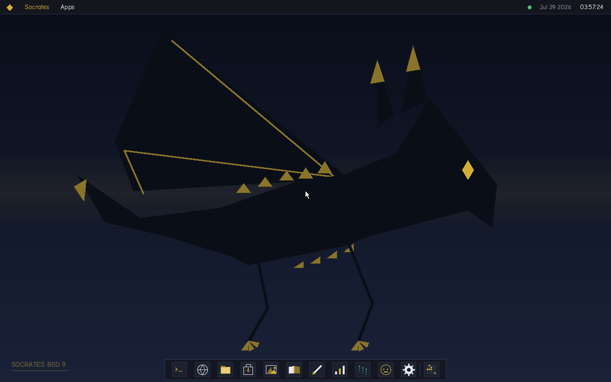
</p>

---

## The short version

It boots on a real machine, draws a windowed desktop with anti-aliased type,
talks to the internet over its own TCP/IP stack with verified TLS, reads a
complete offline Wikipedia, installs applications from a package store, runs
them **in ring 3 in address spaces of their own**, pages them to disk under
memory pressure, and **runs a transformer language model on the CPU** — with
no operating system underneath it and no C library beside it.

Every layer a normal application takes for granted had to be built first.
There is a TrueType rasteriser because there was no way to draw a letter.
There is a Zstandard decompressor because Wikipedia archives are compressed
with it. There is an NVMe driver because a modern machine has nowhere else
to keep a 900 MB encyclopedia.

**142,618 lines of C written here**, across 289 files, built as five kernel
objects plus one for inference, over a user-space C library of its own —
and, since ring 3 got file descriptors and sockets, a freestanding C++
runtime to go with it, down to the Itanium ABI's run-time type
information. A ring-3 program can now fork, exec, signal, and wait for its
children, in Linux's numbering as well as this system's — over pipes, with
signals, waiting on poll. 3.7 million host checks across 17 suites on
every build, and twenty-three more on the machine itself.

---

## Quick start

```sh
git clone https://github.com/mrcalmtuber/vextro
cd vextro
make            # ISO + an 8 GB sparse system volume
make run        # QEMU, full screen, networking up
```

No flags, no arguments, no manual steps. Pre-built ISOs are under
[**Releases**](../../releases) if you would rather not build a cross-compiler.

A bare-metal kernel cannot be built by the compiler that targets your own
operating system, so this needs an **`x86_64-elf` cross toolchain**:

```sh
brew install x86_64-elf-gcc x86_64-elf-binutils xorriso qemu   # macOS
```

On Linux, `xorriso` and `qemu-system-x86` are packaged everywhere; the cross
toolchain generally is not, and `gcc-x86-64-linux-gnu` is *not* a substitute —
it targets Linux rather than bare metal. Build one, or, if your host toolchain
already emits ELF, `make CC=gcc LD=ld` may do. `python3` builds the disk
images. Nothing else — the boot animation is computed by the kernel rather
than decoded, so there is no ffmpeg and no media file in the tree. `make`
names everything missing at once rather than stopping at the first.

You want about **11 GB free**: an 8 GB sparse volume plus 1.4 GB of optional
downloads — **Simple English Wikipedia** (~980 MB) and a **Qwen2 0.5B** model
(~380 MB), fetched from Kiwix and Hugging Face because GitHub refuses any file
over 100 MB.

```sh
make ASSETS=1     # take them without asking (what CI wants)
make ASSETS=0     # skip entirely
make assets       # fetch later, or after saying no
```

Without them the system still boots — the Wikipedia window reports no archive.
`disk.img` is created **once** and then left alone, so your files survive
rebuilds; `make clean` does not touch it and `make cleandisk` resets it.

---

# Architecture

## The kernel is five objects

For most of this system's life the kernel was one translation unit: ninety-odd
headers of `static` functions, 69,000 lines seen by the compiler at once. That
was not laziness — `static` is what let each driver keep its ring buffers and
MMIO map private with no risk of two identically named tables colliding at
link time. It is also what makes naive splitting dangerous: compile two objects
that both include `kheap.h` and each gets **its own free list**. It compiles,
it links, it boots, and it is wrong.

So the split is measured rather than assumed. Four modules had interfaces
narrow enough to write down:

| source | exports | imports | what the object is |
|---|---:|---:|---|
| `src/core/main.c` | — | — | composition root: boot, drivers, desktop, render loop |
| `src/sched/scheduler.c` | 30 | 14 | threads, the 1 kHz timer ISR, the context switch |
| `src/sched/vls_core.c` | 15 | 11 | the Linux ABI: router, signals, wait |
| `src/fs/ntfs/ntfs_ops.c` | 8 | 9 | NTFS, read and write |
| `src/security/anti_virus.c` | 14 | 5 | allowlist, signature automaton, UAC policy |

Everything crossing those boundaries is declared in
**`include/kernel_shared.h`**, and the rule that keeps it honest is that the
four module sources include only that header and their own. `vls_core.c` is
the one that could not have kept the rule unaided: the services it forwards a
translated call to live in `src/desktop.h`, so it reaches them through a table
of function pointers filled in once at boot — the same shape as
`sched_reap_hook` and for the same reason. A module that included that header
would compile, link, and be handed a private copy of the compositor's state.

Around **60 symbols** lost their `static` to make this work — not 2,979. That ratio is the
evidence the seam is real: a de-static'd symbol defined twice fails at link,
where a `static` one defined twice succeeds and hands each object a private
copy.

The composition root keeps the driver and desktop headers because they
genuinely share state — one MMIO map, one heap, one window list — and
separating them would be a rewrite wearing a refactor's clothes.

## The multi-instance scheduler

Applications used to run by pointing the stack pointer at a static buffer and
issuing a `CALL`; the desktop stopped existing until the program returned. A
Mandelbrot that took four seconds froze the pointer, the clock and the
compositor for four seconds.

Now a program is a **thread**, with its own address space, its own 32 KB
kernel stack and its own copy of the floating-point state, and the APIC timer
takes the processor away from it **a thousand times a second**.

- **Strict-priority round-robin** over 64 thread slots — `PRIO_IDLE`,
  `PRIO_NORMAL` (4), `PRIO_UI` (8), `PRIO_MAX` (15). The compositor sits above
  applications, so a program in a tight loop can never cost the interface
  its frame.
- **The switch is the stack pointer.** The timer stub pushes every
  general-purpose register onto the interrupted thread's stack, on top of the
  five words the processor pushed. That block *is* the saved state; switching
  is writing the current stack pointer into the current thread, picking
  another, loading its pointer, and returning. `IRETQ` unwinds into whatever
  that thread was doing — the frame says whether it was ring 0 or ring 3.
- **Extended state does not fit that trick**, because `FXSAVE` writes 512
  bytes to a fixed address rather than pushing. Each thread carries its own
  16-byte-aligned area, and interrupt handlers are compiled
  `general-regs-only` so they cannot disturb what the switch is moving. This
  is what makes floating point safe everywhere: two threads can both be
  halfway through an XMM expression and neither can see the other's.
- **The frame is a critical section.** Rather than lock the window list, the
  terminal ring and the notification queue individually, the render loop
  raises a preemption count while it draws and drops it before it sleeps.
  Applications get the rest of the frame, which is most of it, in
  millisecond slices.
- **Yielding raises the timer vector by instruction**, so there is exactly
  one piece of code in this kernel that knows how to change threads.

`crypto_switch_selftest` is the proof rather than the claim: it holds a
pattern in XMM5 across **182 measured context switches** and requires it back
byte-for-byte, runs four concurrent AES threads to completion, and counts the
switches underneath them. It runs *after* `sti` — run before, the timer cannot
fire and the test passes by never exercising the thing it is named after.

## A C library a port can build against

For most of this system's life the user-space C library was three files
and a thousand lines: `string.c`, `stdio.c`, and a first-fit allocator
over `sbrk`. That was not an oversight. It was exactly what the programs
written for it needed — a Mandelbrot renderer takes one buffer at startup
and keeps it — and every line of it was there because something called it.

It is now nine files and about eleven thousand, and the difference is not
more of the same. It is the four things a program written somewhere else
takes for granted and could not find here:

**`math.h`, computed.** A complete libm: the Cody-Waite and Payne-Hanek
argument reductions, the minimax kernels, `pow` in double-double
throughout. `sin(1e300)` is a question with an answer, which needs π to
about eleven hundred bits because the leading thousand cancel — the table
is in `libc/math.c`. Verified against a reference libm over 3.7 million
arguments per build, function by function, to a stated bound in units of
the last place. `sqrt` is exact; the elementary functions are within an
ulp; the gamma family is not, and `math.h` says by how much.

**`mmap`, which reserves without spending.** `sbrk` moves one line
upward and never gives anything back — fine for one thread and one
buffer, and wrong three ways for a browser. A JavaScript heap asks for
gigabytes of address space and touches megabytes of it, so a reservation
here is a *record* rather than a mapping: `SYS_MMAP` returns in constant
time whatever the size, and the frames are taken one at a time by
whichever page is actually touched. `threadtest` reserves a gigabyte on a
machine with less free than that and measures the cost at zero.

**`pthread.h`, on the scheduler that was already here.** `fork` gives a
child a copy-on-write duplicate of the address space, which is the
opposite of a thread; `SYS_CLONE` gives it *the* address space. Mutexes
of all three kinds, condition variables, read-write locks, barriers,
thread-specific data with destructors, semaphores — all of them blocking
in the kernel through the futex that was already there, and none of them
entering it when uncontended.

**Thread-local storage**, which is the one that reaches furthest down.
A `__thread` variable compiles to a load through the FS segment, so the
segment base is part of a thread's register state exactly as its stack
pointer is, and has to be restored on every switch.

Underneath all four, five new system calls and one correction:
`SYS_CLONE`, `SYS_MMAP`, `SYS_MUNMAP`, `SYS_MPROTECT`, `SYS_SET_FSBASE`
— and `SYS_MEMINFO`, which had been reserved in the table since it was
written and never implemented, so every call to it answered −1.

## A browser engine's backend

WPE is WebKit with the platform taken out: everything an engine assumes
about a window system sits behind `libwpe`, and a *backend* supplies it.
Upstream's two are several thousand lines each, and nearly all of it is
machinery for handing a GPU buffer between two processes without copying
it.

That machinery has nothing to attach to here, and the reason is why the
port is short rather than why it is hard. A Vextro window is not a handle
to be negotiated for — it is a buffer of pixels already mapped into the
process's own address space. The shortest path from a rendered page to
the screen is a memory copy.

`third_party/libwpe/` is vendored unmodified and cross-compiles against
the C library above. `third_party/wpe-port/` is the backend: the four
interfaces WebKit will not start without, the blit with its format
conversion and clipping and scaling, and input translated from Vextro's
*state* — which buttons are down — into the *events* an engine expects.
`apps/wpetest.c` runs all of it in ring 3 on every self-test boot.

**The JIT is off, and not as a preference.** Three of JavaScriptCore's
four tiers work by writing machine code and jumping to it. Here that is
impossible by construction: `SYS_MMAP` and `SYS_MPROTECT` refuse
`PROT_WRITE|PROT_EXEC`, so no sequence of calls from user space arrives
at a page which is both. `threadtest` asserts the refusal in both
directions on every boot.

**Four libraries are ported and run in ring 3**: SQLite 3.45.1 over a
VFS on the descriptor calls, FreeType 2.13.2 reading fonts off NTFS,
HarfBuzz 8.5.0 shaping text over FreeType through upstream's own hb-ft
seam, and ICU 74.2 — 445 translation units and a thirty-megabyte data
archive on the volume. All four are compiled unmodified and verified on
the machine: SQLite reads a database the *host's* sqlite3 wrote,
FreeType agrees with this kernel's own TrueType parser to the pixel, and
ICU sorts a-umlaut before b in German and after z in Swedish, decodes
Shift-JIS, and prints an instant in New York five hours off UTC from the
IANA rules in its archive.

ICU brought two things with it. It is compiled `-frtti`, which everything
else here is not: it uses `dynamic_cast` in 117 places with no fallback,
so `libcxx/` grew the Itanium ABI's type-information hierarchy and
`__dynamic_cast` — checked against the host's own C++ runtime on the same
43 cases, diamonds and ambiguity included. And it needed a calendar, so
`SYS_WALLCLOCK` carries the CMOS clock up to ring 3 and `time()` returns
seconds since 1970 rather than since boot, which it had been doing all
along.

**The engine itself still does not compile**, but the wall has moved
from before the dependency list to inside it. `make webkit` used to stop
at `Unknown OS 'Generic'` — WebKit's build system has a closed list of
operating systems and no category for a target with none, and that fired
before a single `find_package`. It is passed now, without patching one
byte of WebKit: `CMAKE_PROJECT_INCLUDE` runs a file inside `project()`
that asserts `UNIX`, which selects the generic-Unix branch rather than
the Linux one, and the toolchain adds `-D__unix__` because WTF reads
predefined macros rather than CMake variables. Configure now runs
WebKit's whole feature-detection pass against this C library and stops
at `OptionsWPE.cmake:172`. **Every one of the fifteen required
packages that file opens with is now *found* by a real configure run**,
and the frontier has left that block entirely: HarfBuzz
8.5.0 with the components WebKit asks for, ICU 74.2 with `data i18n uc`,
JPEG 62, Epoxy 1.5.10, LibGcrypt 1.10.3, Libtasn1 4.19.0, Libxkbcommon
1.7.0, LibXml2 2.12.6, ZLIB 1.3.1, PNG 1.6.58, SQLite3 3.45.1, Threads,
Unifdef, WebP with its `demux` component, and **WPE 1.16.2** — which had
been staged and never reached since the sysroot was written. LibSoup, on
line 172, is where it stops now.

Two ports cleared seven of those lines between them, which is worth
knowing before guessing what the next one costs. `FindPNG` opens with
`find_package(ZLIB)` and does nothing else if that fails, so zlib
unblocked two lines rather than one, and SQLite3, Threads and Unifdef
had been satisfiable for some time behind them. WebP then unblocked WPE
in the same way — not because they are related, but because a
`find_package` that errors stops the file.

(This paragraph used to say *twenty-two* required packages, and that
number was wrong every time it was repeated. `OptionsWPE.cmake` opens
with **fifteen** unconditional `find_package(... REQUIRED)` on lines
8-22, and carries two more further down — LibSoup and GLIB — for
seventeen in all. Forty-four `find_package` calls appear in the file
altogether, most of them conditional or optional, and that is probably
where twenty-two came from.)

**The three things that were blocking before this no longer are.** There was no `libstdc++` for
`x86_64-elf`, no file descriptors in ring 3, and no sockets in ring 3;
there are now a freestanding C++ runtime (`libcxx/`), twenty-four
descriptor and socket system calls (`src/vfs.h`), and the POSIX layer
over them in `libc/`. What remains of the required list is **GLib with
LibSoup**, which is not a port but a second runtime, and the chain
underneath it has been measured rather than guessed at:

| GLib 2.74 needs | state |
|---|---|
| zlib | done |
| threads | done |
| **libpcre2-8** | done — 61 checks in ring 3 |
| **libffi ≥ 3.0.0** | done, calling half — 32 checks |
| **iconv** | done — GNU libiconv 1.18, 40 checks |

**Every dependency GLib's own `meson.build` declares is now satisfied.**
What stands between here and GLib is no longer a missing library; it is
GLib itself — roughly 400 sources across glib, gobject, gio, gmodule and
gthread, with a meson build to reproduce by hand and a `gio-unix`
component whose optional features (`/proc/mounts`, inotify, `SCM_RIGHTS`)
this system does not have. Those three are optional rather than
blocking, and measurably so: `gio/meson.build:774` compiles the inotify
backend only when the header and `inotify_init1` are both found and
otherwise uses the polling monitor, and `gunixmounts.c` yields an empty
mount list rather than failing.

Beyond GLib sit LibSoup 3, the `libc` gaps WebKit's own configure named
(`langinfo.h`, `strnstr`, `regexec`), and — before any browser runs — a
2D rasteriser (Skia or Cairo) and an OpenGL implementation, neither of
which exists here.
Two items are depth rather than breadth: an OpenGL implementation, and a
real `WTF_OS_VEXTRO` for the places WTF assumes a process model this
system has no answer for. `third_party/wpe-config/README.md` sets it out
in order, and `make webkit` names what is missing at once.

## File descriptors and sockets in ring 3

Until recently a program in ring 3 had exactly one way to touch the
filesystem — `SYS_FS_WRITE`, which takes a path and replaces a whole
file behind a prompt — and no way at all to reach the network, though
the kernel has run lwIP and Mbed TLS for as long as the browser has
existed.

Neither gap was an oversight. Both were the absence of the same idea. A
file read a window at a time has a *position*; a connection has a peer
and a state machine; neither can be named by a call that takes a path
and returns. A descriptor is a name for state the kernel holds between
two calls — and once there is a table of those, `read` and `recv` stop
being two problems.

The table hangs off the address space rather than the thread, which is
what makes the three POSIX rules fall out rather than be implemented:
threads share descriptors because `SYS_CLONE` shares the address space,
a fork copies them because it makes a new one, and they close when the
last thread of a process exits because the address space is refcounted.

| | |
|---|---|
| Files | `open`, `read`, `write`, `close`, `lseek`, `stat`, `fstat`, `unlink`, `mkdir`, `fsync`, `ftruncate` |
| Directories | `getdents`, and `opendir`/`readdir` over it |
| Sockets | `socket`, `connect`, `send`, `recv`, `shutdown`, `setsockopt`, and name resolution |
| Streams | real `FILE` objects, `fopen`/`fread`/`fgets`/`fseek`, the `scanf` family |

**Writing is a whole-file operation, and the interface says so.** NTFS's
writer here replaces a file rather than updating it in place, so a
descriptor opened for writing holds the file's image in the kernel and
puts it back at `close()` or `fsync()`. That is what the filesystem
underneath can actually do; a `write()` that appeared to work and lost
everything between the last flush and a power cut would be worse.

**A connection is asked about once.** The first time a program connects
anywhere other than loopback, a prompt names the address, and the answer
— grant *or* refusal — is remembered for the life of that program. It is
deliberately not the same bit as the elevation prompt: saying yes to
"may this fetch a page" must not also say yes to "may this overwrite the
partition table". With nobody signed in the answer is no, immediately,
which is the state a machine at its login screen is in.

**TLS is a socket.** `socket(AF_INET, SOCK_STREAM, IPPROTO_TLS)` gives a
descriptor that is a TLS 1.3 session, driven through the same `send` and
`recv`. The caveat is unchanged and is repeated everywhere it is
mentioned: there is no certificate authority store on this volume, so
the chain is parsed and the handshake signature checked against the key
in the leaf, and nothing establishes that the leaf belongs to the host
that was asked for. That stops somebody listening; it does not stop
somebody in the middle.

## A C++ runtime

`libcxx/`, written for the same reason `libc/` was. The cross compiler
had a C++ front end and no C++ *runtime* — `-print-file-name=libstdc++.a`
echoed its input back — and building GNU's or LLVM's would have brought
locales, iostreams and a threading model this system does not have.

What the compiler emits calls to whether or not anybody writes them:
`operator new` and `delete` in all twelve forms, `__cxa_atexit` and the
static destructors it runs in reverse, the guard variables that make a
function-local static thread-safe — over the kernel's own futex, so a
thread that loses the race is descheduled rather than spinning — and the
three that mean the program is already wrong. Then twenty-eight headers:
`<vector>`, `<string>`, `<memory>`, `<algorithm>`, `<atomic>`,
`<mutex>`, `<optional>` and the rest.

Since the descriptor work, four more headers that WebKit specifically
asks for: `<chrono>` over the scheduler's tick (with `<ratio>`
underneath, which nobody asks for and duration arithmetic cannot be
written without), `<thread>` over `SYS_CLONE`, `<unordered_map>` with
chained buckets — because the standard requires references to survive a
rehash and with open addressing the elements *are* the array — and
`<variant>`, dispatching through a function-pointer table generated by
position.

Exceptions are off, because there is no unwinder for this target. So
`at()` out of range prints the index and stops, plain `operator new` on
exhaustion prints and stops, and `new (std::nothrow)` returns null —
which is what its callers check. Returning null from the plain form is
the option that looks gentlest and is the dangerous one: code compiled
against a throwing `new` does not check, so null is not an error path,
it is a fault inside the constructor reported as the wrong thing
entirely.

## A Linux subset, so that a program can start a program

`include/vls.h` and `src/sched/vls_core.c`. Until now a ring-3 program on
this system could ask for things *about itself* and nothing else. It could
fork — that has existed since system call 23 — and the fork was half of a
pair with no other half: the child could only run the code its parent was
already running, and when it stopped, nobody could be told.

A browser is the program that makes that insufficient. WebKit is not one
process; it is a UI process that forks a web process and a network process,
hands them descriptors, and expects a signal when one dies. So five calls
arrived together, native rather than emulated — `execve`, `wait4`, `dup`,
`dup2` and `personality` — and beside them a translation layer for programs
that were compiled against Linux's numbering rather than this one's.

**The renumbering itself turned out to be nearly free**, and that is worth
saying because it was the part expected to be the work. This system's own
descriptor calls were written against Linux's constants deliberately —
`O_CREAT` is `0100` in `src/syscall.h` because that is what the code being
ported says — so thirty of the sixty-seven rows in the table are a change of
call number and nothing else. What was actually hard was the four places
Linux has a *concept* this system did not:

| | what had to be built |
|---|---|
| **Signals** | The only way a program here can be told anything it did not ask for; everything else in this kernel is call-and-answer. A caught signal lays a frame on the interrupted thread's own stack — `siginfo_t` and a `ucontext_t` at the offsets a handler expects — and `rt_sigreturn` restores from the *ucontext*, so a handler that assigns `gregs[REG_RIP]` and returns lands where it asked. That is the one thing a JIT actually does with a `SIGSEGV` handler. |
| **`exec`** | The only operation that changes what a process *is* without changing which process it is. The whole new address space is built before anything is torn down, because a failed exec must leave the process runnable. It is also the first code here to *read* the close-on-exec flag, which every `open` has recorded since descriptors existed. |
| **`wait`** | Requires a process to have a parent, which requires a process to have an *identity*. There was none: `thread_t.pid` names a thread, so two threads of one program had two of them and neither was the program's. `addr_space_t` now carries Linux's `tgid` distinction. |
| **`clone(CLONE_VM)`** | Whose child returns from a call it never made. Native `SYS_CLONE` takes an entry point and cannot express it, so the table does not pretend: the flags are inspected, a combination outside the subset is refused by name, and `sched_clone_thread` copies the parent's register file the way a fork does with the address space left shared. |

Two doors lead to the same room, and both are needed. A call number at or
above `0x40000000` is a Linux number with a bias added — unambiguous, needs
no state, and works from a program that is otherwise native. A **personality**
flag on the address space says every *unbiased* number from that process is a
Linux number, which is what an actual Linux ELF will need, since its calls
were compiled long before they got here. The signal trampoline is the proof
that both are necessary: it lives on the shared trampoline page, is the same
bytes in every process, and issues the *biased* number — so one stub serves a
native process that caught a signal and a Linux one that did.

`/dev` is answered before the volume is consulted, which is the semantics
rather than an optimisation: a file called `\dev\null` on the disk must not
be able to shadow the device. Eight nodes — `null`, `zero`, `full`, `random`,
`urandom`, `tty`, `dri/card0`, `dri/renderD128` — and none of them passes
through the elevation gateway, because that gateway guards the three ways a
program can change the machine permanently and writing to `/dev/null` is none
of them. A write to the render node lands in the calling process's own window
surface. What that is *not* is a DRM device: real DRI is almost entirely
`ioctl`, this kernel has none, and the table answers `ENOTTY` — which is what
a program reads as "not the device I hoped for" rather than "this system is
broken".

An unmapped call is `ENOSYS` and one `[VLS]` line on the serial port naming
itself, with all six argument registers. Never a halt. That line is how the
list of what to build next gets written by the programs that need it rather
than guessed at in advance.

`apps/vlstest.c` runs **164 checks** on the machine, including a child that
sets the personality and from that instant speaks nothing but raw Linux system
calls, and one that takes a real page fault and reports the address its
handler was given.

## Ports, and what each one cost

Eighteen libraries are built from upstream sources, unpatched, and run
in ring 3. Each is fetched by checksum (`make libs-fetch`) and gitignored,
and each is checked on the machine rather than assumed:

| | version | in ring 3 | what it actually needed |
|---|---|---|---|
| SQLite | 3.45.1 | 32 checks | `SQLITE_OS_OTHER=1` and a VFS, so the VFS *is* the OS |
| FreeType | 2.13.2 | 35 checks | four modules and the stock ANSI `ftsystem.c` over our FILE streams |
| HarfBuzz | 8.5.0 | 32 checks | three C++ headers and `__popcountdi2` from libgcc |
| ICU | 74.2 | 54 checks | the Itanium ABI's RTTI, and a wall clock — its data ships prebuilt |
| libjpeg-turbo | 3.0.4 | 20 checks | two hand-written config headers; built at three precisions, no SIMD |
| libepoxy | 1.5.10 | 19 checks | `dlopen`/`dlsym` over a table, because there is no dynamic linker |
| libgpg-error | 1.50 | — | four generated headers, two host tools, and an errno table that had to be preprocessed by the *cross* compiler |
| libgcrypt | 1.10.3 | 33 checks | pipes, `poll` and `socketpair`, which it needed before it would link |
| libtasn1 | 4.19.0 | 94 checks | `WORD_BIT` in `<limits.h>`, and gnulib's `strverscmp` — this C library had neither |
| libxkbcommon | 1.7.0 | 67 checks | 2.7 MB of xkeyboard-config on the volume, and a formatter that can write a directory of 138 names |
| libxml2 | 2.12.6 | 66 checks | nothing — the first port that needed no new interface at all |
| zlib | 1.3.1 | 138 checks | nothing either; its configuration is two `#ifdef`s answered twice over |
| libpng | 1.6.58 | 73 checks | `setjmp`, which had been in `libc/` for years with nothing in ring 3 using it |
| libwebp | 1.6.0 | 103 checks | nothing — but it is two archives, and the first port to compile SIMD in |
| PCRE2 | 10.48 | 61 checks | nothing — the first port WebKit never asks for; it is GLib's |
| libffi | 3.5.2 | 32 checks | half the library. Closures need writable-executable memory, which this kernel refuses |
| GNU libiconv | 1.18 | 40 checks | nothing — three objects and 274 pre-generated tables |
| WPE | 1.16.2 | 40 checks | the backend seam in `third_party/wpe-port/` |

Three of them say something about the shape of this system rather than
about the libraries. libjpeg-turbo is compiled three
times over — at 8, 12 and 16 bits per sample — because version 3 selects
precision at run time and skipping the other two passes leaves the
dispatch calling functions that are not in the archive. And libepoxy is
a *dispatcher*: it resolves two thousand OpenGL entry points by name
through `dlsym`, which is why `libc/dlfcn.c` exists and why it is a name
table rather than a loader. Nine of those two thousand resolve here.

And libgcrypt is the one that could not be made to link at all until the
kernel grew something. Its error library's `visibility.c` defines every
public `gpgrt_` name in one file, including the process-spawning ones, so
the locks libgcrypt actually wants drag in a module that calls `pipe()`
and `socketpair()` — neither of which existed. Both do now, along with
`poll()`, and `src/vfs.h` has a descriptor kind that is a buffer with two
ends. That was the last of the four things `libc/include/unistd.h` used
to list as absent.

libtasn1 is the smallest of the eighteen and the one whose test is the most
specific: the ASN.1 module it compiles is a verbatim copy of the one WPE
WebKit carries in `pal/crypto/tasn1/Utilities.cpp`, and every structure
it decodes came out of the build machine's OpenSSL. Neither is
incidental. A module written to be easy to parse would not have shown
whether WebKit's builds, and a structure encoded here and decoded here
would agree with itself even if both halves shared a wrong idea of how
an OBJECT IDENTIFIER is packed — the same reason `jpegtest` reads a
bitstream macOS encoded.

zlib and libpng arrived together because they had to: CMake's `FindPNG`
begins with `find_package(ZLIB)` and its whole body is inside
`if (ZLIB_FOUND)`, so the PNG line was reporting two missing packages.
Neither needed a new interface — every call they make, down to `pow` and
`setjmp`, was already in `libc/` — but libpng is the first thing in ring
3 to *use* `setjmp`, because it does not return error codes: `png_error`
calls the caller's handler, which must not return, and the way it does
not return is a `longjmp`. `libc/setjmp.S` had been sitting there for
years with nothing above it to notice if it saved the wrong registers.

Their tests are built the same way as `jpegtest`'s and for the same
reason. `apps/zlib_ref.h` holds DEFLATE produced by **Apple's
libcompression**, with the RFC 1950 and RFC 1952 wrappers written from
the specifications rather than by zlib's own writer. `apps/png_ref.h`
holds six PNGs built from the specification by `tools/mkpngref.py` and
one re-encoded by macOS's ImageIO — and one of the six uses a different
row filter on *every row*, which no real encoder would produce and which
is the only way to know the Average and Paeth reconstructions are right.

**WebP is the one where that could not be done, and the tree says so.**
There is no second implementation of VP8 on this machine: macOS reads
`.webp` through ImageIO and ImageIO bundles libwebp — which is how the
2023 VP8L overflow became a macOS security update. So the bitstreams in
`apps/webp_ref.h` were encoded by the same sources compiled for the
*host*, and every check against them establishes agreement across three
**builds** rather than across implementations. Two things recover most
of what that costs. The lossless images are generated from a formula, and
lossless WebP is bit-exact by definition, so that chain — formula,
encoder, decoder, formula — depends on nothing being trusted. And the
animation's RIFF container was assembled from the WebP specification by
`tools/mkwebpref.py` rather than by libwebp's muxer, which is precisely
what the RFC 1952 wrapper is to zlib, and matters more here because
`COMPONENTS demux` is what line 20 asks for.

**PCRE2 and libffi are the first two ports WebKit never asks for.**
Neither appears anywhere in `OptionsWPE.cmake`; both are **GLib's**, and
GLib is line 185. GLib 2.74's own `meson.build` makes `libpcre2-8` and
`libffi >= 3.0.0` required dependencies — GRegex *is* PCRE2 since GLib
stopped bundling a copy, and `gobject/gclosure.c` marshals every generic
signal closure through `ffi_call`. They are staged in the same sysroot
with `.pc` files, because meson finds dependencies through pkg-config and
that is where the toolchain points it.

Both ran into the same wall from opposite sides, and it is this system's
own: **`src/desktop.h:2449` refuses any mapping that asks for
`PROT_WRITE` and `PROT_EXEC` together.** `libc/include/sys/mman.h` has
said for a long time what follows from that — "this is what makes a
just-in-time compiler impossible here rather than merely discouraged" —
and named WebKit's JIT tiers as the first casualty. PCRE2's JIT is the
second and libffi's closures are the third.

Neither is a loss worth paying for. GLib calls `pcre2_jit_compile` and
has an explicit `case PCRE2_ERROR_JIT_BADOPTION:` that falls back to the
interpreter, so the port compiles without the JIT and `apps/pcre2test.c`
takes that branch deliberately. libffi is built as its calling half
only: `src/closures.c` is not compiled, so `ffi_closure_alloc` is absent
from the archive and anything wanting one fails at link naming the
symbol rather than faulting inside a heap buffer later. GLib never wants
one — measured, not assumed: the libffi entry points named anywhere in
GLib are `ffi_prep_cif`, `ffi_call` and the `ffi_type_*` descriptors.

It is also the first port to compile SIMD *in*. libjpeg-turbo's is NASM
driven by upstream's own CMake and was left out; libwebp's is C
intrinsics, so the SSE2, SSE4.1 and AVX2 kernels are built with their
matching `-m` flags and selected at run time by CPUID. That is only
defensible because it can be checked: `apps/webptest.c` swaps libwebp's
own CPU-detection hook for one reporting a processor with nothing, decodes
again, and requires the two results to be identical to the byte. An
optimisation nobody can test is a liability.

## The interface, from utility classes

The browser's chrome and start page are not drawn by colours written into
the drawing code. They come from `assets/ui/browser.vxml` — Tailwind
utility classes over the design tokens in `assets/ui/tokens.tw` —
resolved at build time by `tools/tailwind.py` and laid out at run time by
`src/vxui.h`.

| | |
|---|---|
| `vextro-gold-light` | `#FFEFA6` — active buttons, link highlights |
| `vextro-gold` | `#D4AF37` — the signature metallic tone |
| `vextro-gold-dark` | `#8C6D1F` — structural borders and dividers |
| `vextro-bronze` | `#4A3B12` — high-contrast primary text |
| `vextro-charcoal` | `#171614` — the baseline dark background |

**Why a compiler rather than a stylesheet.** Nothing here parses CSS —
the built-in browser turns HTML into word-wrapped lines and discards
`<style>`, and WebKit does not build yet. But Tailwind *is* a resolver:
classes in, a small set of declarations out, only the ones used. That
part ports to a machine with no CSS engine, because the output need not
be CSS. Here it is a table of resolved styles the compositor draws
directly, so the class strings are load-bearing. The stylesheet is
emitted too, from the same resolution, against the day the engine builds.

**Styles are resolved at build time; geometry is not.** A colour is a
colour and `px-4` is sixteen pixels whatever the window is doing. But the
browser window is resizable, so a baked coordinate would be right at one
size only — the flex solve happens against the rectangle the compositor
hands over. The self-test asserts exactly that, by solving the same tree
at two widths and checking the `flex-1` address field absorbed the
difference while the fixed groups either side did not move.

**And the pixels are checked.** A headless harness cannot look at a
screen, so the chrome is drawn into a scratch buffer and read back
against the exact token values: the header strip must be `#171614`, the
divider `#8C6D1F`, the address border `#D4AF37`. Twenty-four assertions
on every self-test boot.

The palette does not touch the rest of the system. `C_GOLD` in `gfx.h`
has been `#D4AF37` since the theme was written — this formalises a design
language rather than replacing one — and the legacy constants that colour
the taskbar and window frames are deliberately left alone.

## Ring 3 hardware isolation

An application is a thread **in ring 3, in page tables of its own**. The lower
half of its address space maps four things: its image, its stack, one page of
syscall trampolines, and the pixels of its own window. Everything else in the
machine — the kernel, the framebuffer, the disk cache, every other process —
is either in the half its descriptors forbid or is not mapped at all.

- Text pages are read-and-execute, data pages writable and never executable —
  **W^X on every loaded image**.
- **Page zero is deliberately absent**, so a null dereference faults instead
  of reading whatever the image starts with.
- The kernel half is shared **by reference**, so a process switch is one CR3
  write and no table copying.

**Two doors in, and they are not interchangeable.** `int 0x80` is the old one,
kept because binaries emitting it are installed on real disks, and it
preserves *every* register including RAX — which is not a nicety. GCC compiles
two `os_print`s in a row into one `mov eax, 1` and two interrupts, so a gate
that returned a value in RAX would silently turn the second call into a no-op.
That was found by a program appearing to skip a line. Anything needing an
answer back uses `SYSCALL`. Both land on a kernel stack, build one register
frame, and check every pointer that crosses.

**A fault in ring 3 is an ordinary event.** The handler prints the vector, the
decoded error code, the faulting address and the thread, then kills that
thread by rewriting its exception frame to return into the kernel — and the
desktop keeps drawing. `/faulter` is on the volume and exists to prove it: it
writes through a null pointer on purpose, because the interesting property of
a protected system is not that correct programs run.

## Page swapping

Demand paging to a **256 MB `pagefile.sys`**, 65,536 slots, resolved to one
raw extent at boot so that **no filesystem code runs inside a page fault** —
a fault that had to walk the MFT to find its own backing store would
deadlock the first time it faulted on a buffer that walk was using. The
formatter preallocates it as a single run, because that is the only way
one can be *guaranteed* rather than hoped for, and the kernel refuses to
enable swap at all rather than use a fragmented one.

- **Clock replacement** over a reverse map from physical frame back to the
  mapping that owns it, revalidated against the page tables before anything
  is evicted.
- A swapped page is recorded **in its own page table entry** — bit 10 of a
  non-present entry, which the processor ignores and which cannot alias the
  copy-on-write bit that shares the field.
- **User pages only.** Kernel memory, page tables and shared frames never
  leave RAM. A page the fault handler itself might touch is not a candidate.

## The filesystem, and why it is NTFS

`disk.img` is NTFS, and the system boots from it. It was exFAT for as
long as this system had a filesystem, and the switch was held back
deliberately until the writer had somewhere safe to be wrong: a
half-exercised filesystem writer pointed at the volume holding someone's
account is the one bug with no recovery.

`tools/mkntfs.py` formats it — there is no `mkntfs(8)` on a Mac, and the
layout has to be one `src/fs/ntfs/ntfs_ops.c` agrees with byte for byte.
What the driver implements is the part that actually allocates:

| | |
|---|---|
| `$Bitmap` | first-fit cluster allocation, persisted before the caller sees the run |
| `$MFT` | record allocation past the sixteen system files |
| data runs | signed-delta encoding, checked against the reader's own decoder |
| `$INDEX_ROOT` | ordered insert and remove of `$FILE_NAME` entries |
| paths | per-component resolution from record 5, case-insensitively |
| ranges | a window out of a file, seeking within the run list |
| `$UsnJrnl` | change records in the documented v2 format |
| journal | a write-ahead redo log — payload, then commit, then the write — replayed on mount |

**Two layout decisions are load-bearing**, and both are the formatter's
job rather than the kernel's:

*Every file is one contiguous run.* Not for speed. Without
`$ATTRIBUTE_LIST` — which this driver does not write — a file's entire
run list has to fit inside its own MFT record, and a 937 MB archive
broken into a few thousand fragments would not. Allocating sequentially
makes every run list exactly one entry, whatever the file's size. The
pagefile gets the same treatment for a different reason: the pager
resolves it to one absolute LBA at boot and cannot use a fragmented one.

*MFT records are 4096 bytes rather than the usual 1024.* That used to be
the directory ceiling; it now sets the fan-out of a directory's root
node — about thirty children before the root itself splits — and how
much of a small directory stays in the record instead of costing a
cluster. 4096 is the ceiling rather than a preference: the kernel reads
a record into a 4096-byte buffer and refuses a volume claiming more.

### Directories are B-trees

A directory starts as a resident `$INDEX_ROOT` inside its own MFT
record, which holds about thirty-five names. When that fills, the whole
index moves into `$INDEX_ALLOCATION` — a non-resident attribute divided
into 4096-byte `INDX` blocks, each with its own update sequence, tracked
by an `$I30` `$BITMAP` — and the root becomes the top of a B-tree.

Nodes are split **on the way down**. The textbook alternative descends,
inserts at the leaf, and carries an overflow back up, which needs the
whole path in memory and a special case when the root overflows.
Splitting any node that could not accept a maximum-size entry *before*
entering it means the leaf insert can never fail, so nothing has to come
back up. It costs a node splitting while six hundred bytes of it are
still free; it buys away the entire class of bugs that lives in
unwinding a half-finished insert.

Deletion is the harder half. A name in an interior node is a
*separator* — the tree below is divided by it — so it cannot simply be
removed; its in-order successor has to take its place. That successor
arrives from a leaf, gains a downlink, and **may be longer than the name
it replaces**, which makes deleting an entry the one operation here that
needs more room than it frees. The same pre-emptive splitting covers it.
Nodes are left under-full rather than merged, which is legal NTFS; the
blocks come back when the directory is deleted.

Two ordering rules keep an interrupted operation recoverable: a child
block is always durable before anything points at it, and the directory
record — written by the caller, last — is what makes any of it
reachable. A power failure mid-split leaks an index block. It never
leaves a pointer into one that was never written.

> One bug found here is worth recording, because it was invisible in
> every structural check. Installing an update sequence *replaces* the
> last two bytes of each 512-byte sector with the sequence number — so a
> block that has just been written is no longer the block in memory. A
> descent writes a parent after splitting a child and then seeks in that
> same parent again to pick a half; the seek was reading two bytes of
> sequence number in the middle of whichever name straddled offset 510.
> One key in two thousand went into the wrong subtree. Every node passed
> a structural walk, every entry length was sane, and the only symptom
> was a single inversion in an enumeration.


### How it was checked before anything booted from it

Three gates, because "the writer returned success" is not evidence that
a volume is correct:

- **193 host checks** against scratch images — the run-list encoder
  against the *decoder*, path resolution including the paths that must
  *fail*, ranged reads at cluster boundaries and past end-of-file, the
  journal replayed against a deliberately interrupted write, and a
  two-thousand-name directory built to depth three, enumerated in
  strictly ascending order, then emptied one separator at a time.
- **`make verifydisk`** mounts the real 8 GB image with the kernel's own
  driver, on the host, and compares every seeded file byte for byte
  against its source — including `wiki.zim`, read in windows through the
  same ranged path the archive reader uses. Two implementations written
  from one specification, made to agree about what one of them produced.
- **A reboot.** The system writes files, an account and a registry hive;
  the machine is stopped; it comes back and every byte is still there,
  and the login screen offers the account rather than first-run setup.
  `make iso EXTRA=-DFS_SELFTEST` runs that check itself, in two halves
  across two boots.

- **A third implementation.** `tools/ntfsdir.py` walks a directory from
  the on-disk structures alone, in Python, sharing no code with either
  the formatter or the driver — because two implementations written
  together from one reading of a specification can agree perfectly and
  both be wrong. It lists the same three hundred names the kernel wrote,
  in the same order.

macOS's own filesystem prober identifies the result as NTFS, volume name
`Vextro`.

### What is deliberately absent

`$ATTRIBUTE_LIST` — a file whose attributes outgrow one MFT record is
refused rather than spread across several. Also
compression, and NTFS's own `$LogFile`, whose redo record format is not
publicly specified: what protects writes here is this system's journal,
not one Windows would replay. chkdsk has never been run against a volume
this driver wrote.

exFAT and FAT32 are still in the tree and still mount — a volume made by
an older build, or a stick from another machine, is read exactly as
before. What changed is what `make` lays down.


## Hardware drivers

Three storage buses, probed newest first, behind **one 512-byte sector view**:
**NVMe**, **AHCI/SATA**, legacy **ATA PIO**, plus **USB mass storage**. A
machine bought in the last ten years has no IDE controller at all, so without
the first two the OS boots and finds nothing.

Two details easy to skip and expensive to get wrong:

- **Physical contiguity.** A DMA engine is handed physical addresses, and a
  buffer that is one array to C is one array to the device only if its pages
  happen to be adjacent. They are, under this bootloader — which is exactly
  how a driver works on the machine it was written on and corrupts memory on
  the next one. Buffers are resolved page by page and coalesced.
- **Block size.** NVMe namespaces are increasingly not 512 bytes, and every
  filesystem above expects that they are. The translation includes the
  read-modify-write a partial write needs; without it, writing one sector on
  a 4K drive destroys the seven either side, silently.

**xHCI** carries HID boot protocol, mass storage over Bulk-Only Transport with
SCSI, and hubs five tiers deep with route strings and transaction
translators — all hot-pluggable. **HD Audio** walks the codec graph, with
AC'97 as the fallback and an eight-voice mixer above both. **Intel Gen9**
drives the blitter through a private GGTT window and the BCS ring, and when a
submission's breadcrumb never lands it latches the i915-style error state —
EIR/ESR, the exact command header that broke the pipeline decoded by name,
ACTHD, INSTDONE, GGTT faults, the ring contents around the parse point —
attempts an engine reset, and falls back to CPU rendering after repeated
hangs. `gpu error` prints the report.

---

## What it looks like

<table>
<tr>
<td width="50%">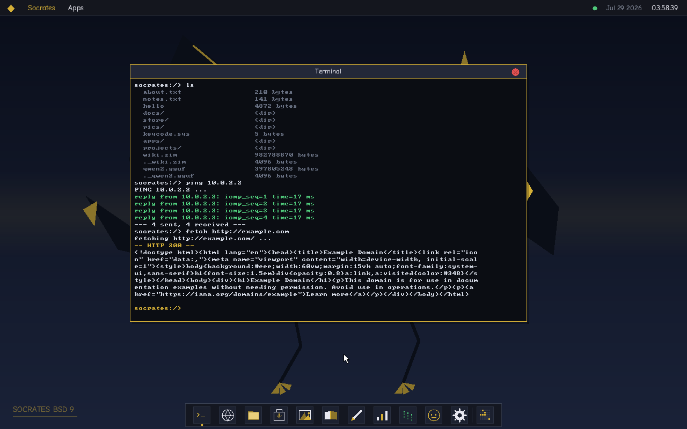</td>
<td width="50%">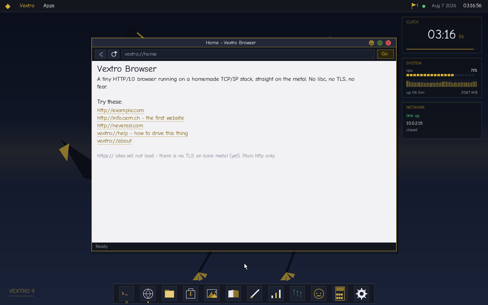</td>
</tr>
<tr>
<td><b>Shell</b> — 161 commands over a real filesystem, with <code>ping</code>
and <code>fetch</code> going out over lwIP and eight conversations able to be
in flight at once.</td>
<td><b>Browser</b> — <code>info.cern.ch</code>, the first website, fetched and
rendered on bare metal. <code>https://</code> works over TLS 1.3, on a thread
of its own so a slow site never freezes the desktop, and the server's chain is
<b>verified</b> against the roots in <code>/etc/ca-bundle.crt</code>.</td>
</tr>
<tr>
<td>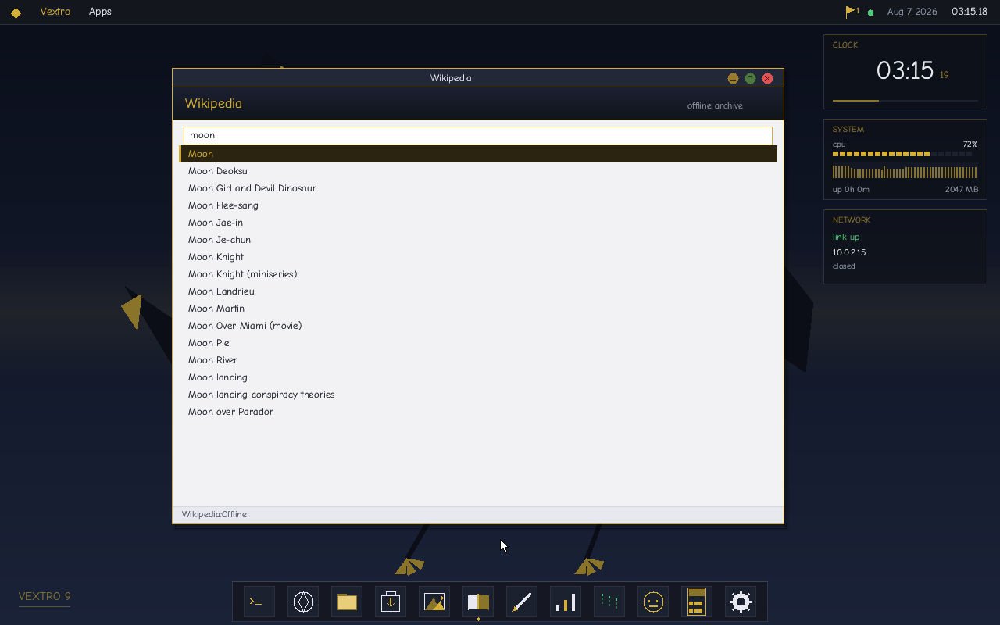</td>
<td>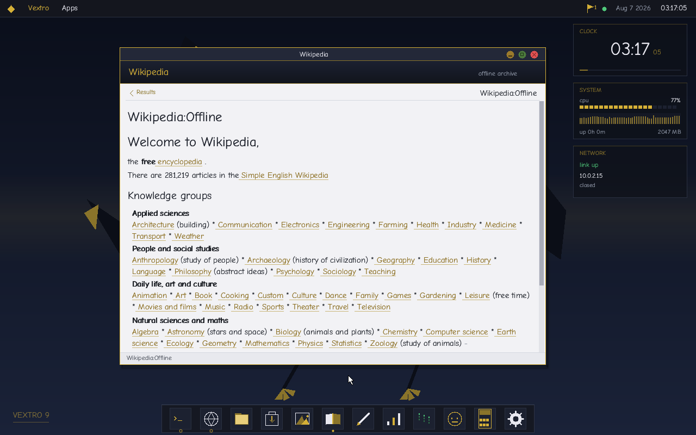</td>
</tr>
<tr>
<td><b>Offline Wikipedia</b> — live prefix search across <b>399,853
entries</b>, answered by binary search over the archive's sorted path list.
About twenty reads, and it barely slows as the archive grows.</td>
<td><b>Articles</b> render through a layout engine with a run-based line
model, so a sentence full of links stays one sentence. Internal links resolve
back into the archive, and Back restores your reading position.</td>
</tr>
<tr>
<td>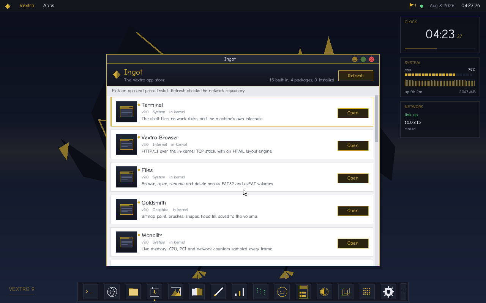</td>
<td>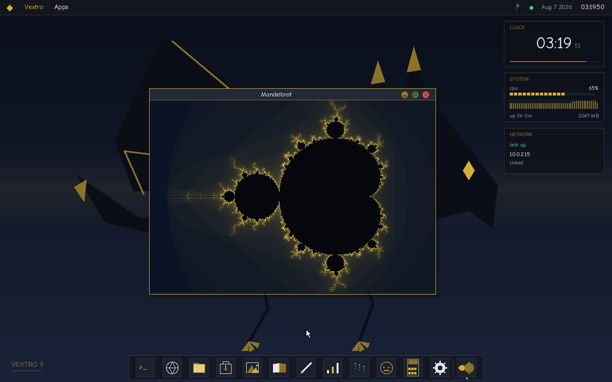</td>
</tr>
<tr>
<td><b>Ingot</b> — the app store lists every application on the machine,
built-in and installable alike, so it answers "what is on this machine" and
not merely "what else could be". Install writes a validated payload and
records it in a registry, so installed apps survive a reboot.</td>
<td><b>…and they run.</b> In ring 3, in an address space of their own, on a
thread the scheduler preempts a thousand times a second. This Mandelbrot is
computed in double precision straight into the window's pixels, which are
mapped into the process.</td>
</tr>
<tr>
<td>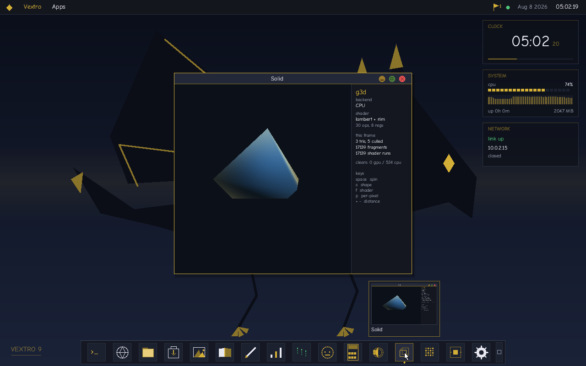</td>
<td>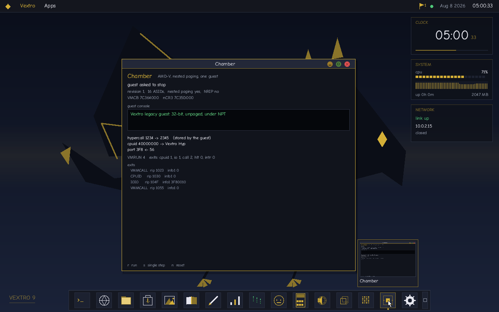</td>
</tr>
<tr>
<td><b>Solid</b> — 3D through <code>g3d</code>. The panel is the API reporting
on itself: which backend is live, how many triangles survived culling, how
many fragments were shaded, and the compiled size of the shader.</td>
<td><b>Chamber</b> — a guest on AMD-V. The green line was written by guest
code storing to <code>0xB8000</code>, translated by nested page tables; every
exit in the log is a real VMEXIT at an address matching the disassembly.</td>
</tr>
<tr>
<td>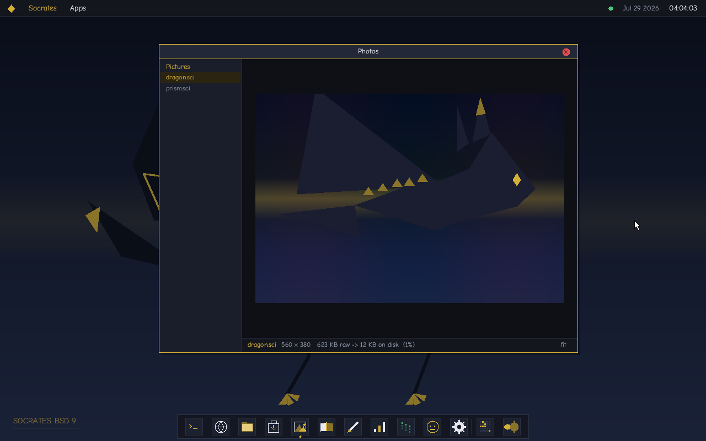</td>
<td>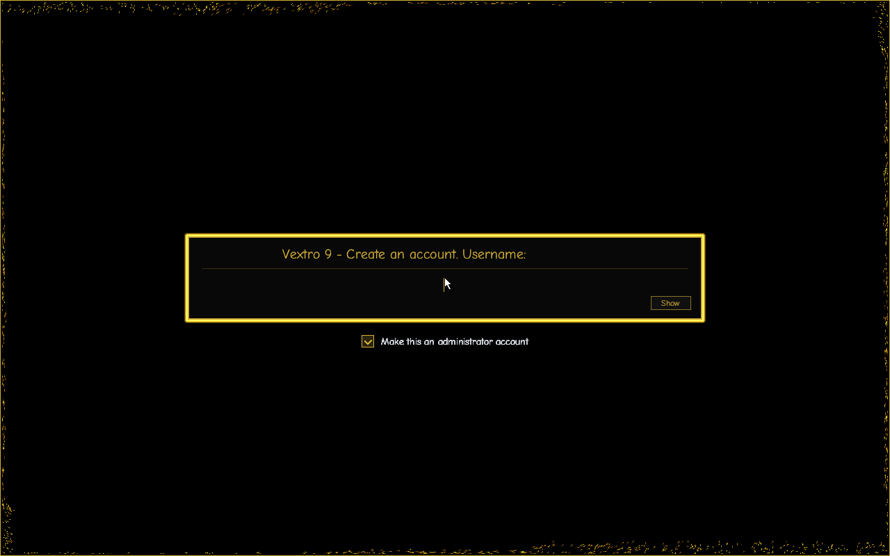</td>
</tr>
<tr>
<td><b>Photos</b> — a custom image format: PNG-style row prediction filters
over an LZMA stream. The status bar is not marketing, it is the file:
<b>623 KB → 12 KB</b>.</td>
<td><b>Login</b> — real accounts. Salted SHA-256 iterated 4,096 times,
compared in constant time, with per-user home directories. A wrong password
melts the screen.</td>
</tr>
</table>

### The desktop

<table>
<tr>
<td width="50%">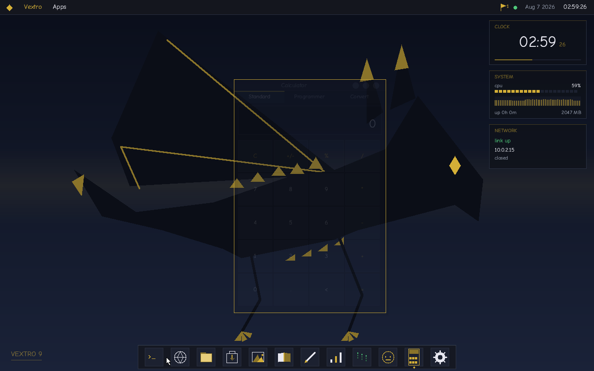</td>
<td width="50%">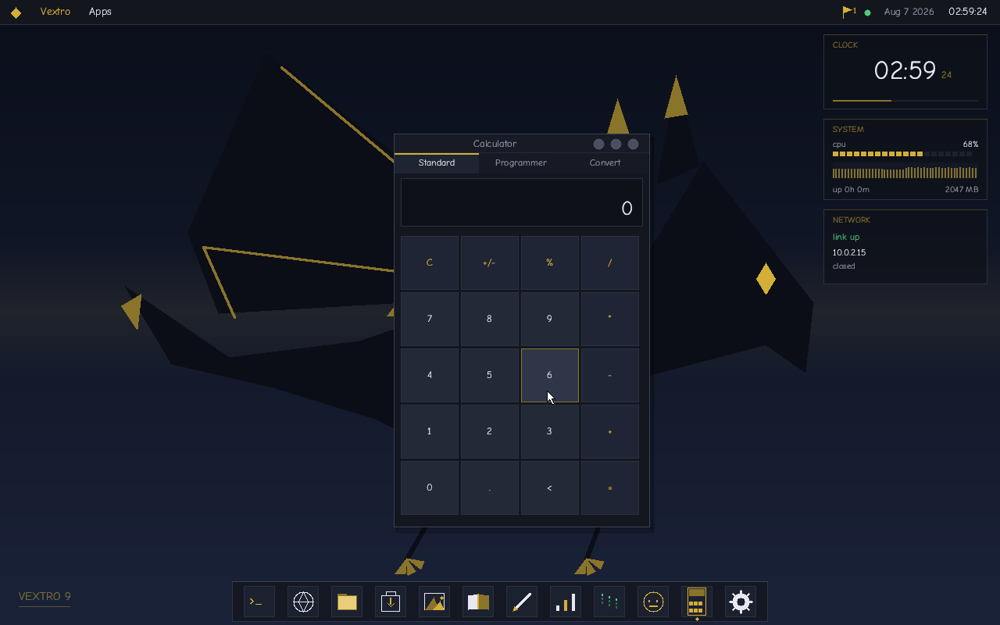</td>
</tr>
<tr>
<td><b>Peek and previews</b> — click Show Desktop and every window fades
towards what is behind it, leaving its outline. It is a latch, not a hover, so
crossing the taskbar never dissolves your work. The preview above a button is
the window itself, captured out of the compositor.</td>
<td><b>Snap</b> — drag a window to an edge and it takes half the work area;
to the top and it fills it. The target is previewed while the button is held,
so the gesture can be abandoned.</td>
</tr>
<tr>
<td>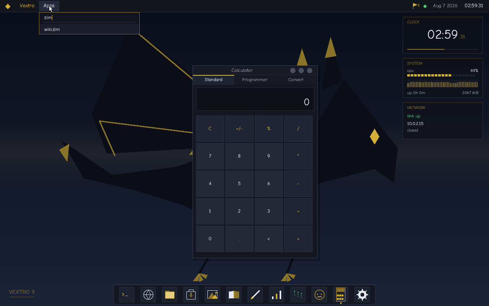</td>
<td>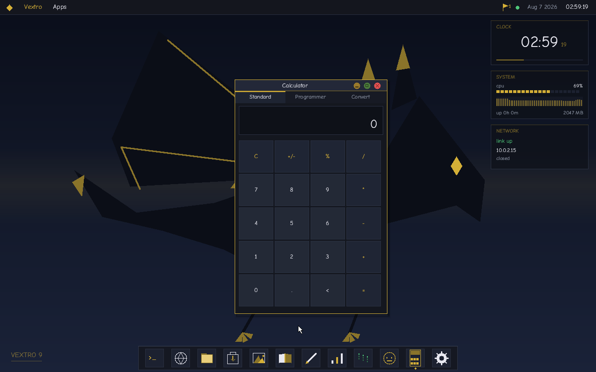</td>
</tr>
<tr>
<td><b>Search</b> — type in the start menu and it looks through applications,
what each app was recently pointed at, and the volume itself, breadth-first
under a budget so it cannot cost a frame.</td>
<td><b>Calculator</b> — three modes, not one floating-point instruction.
Values are 64-bit integers scaled by a million, so 12.5 × 8 is exactly 100 and
1000 mm is exactly 1 m.</td>
</tr>
</table>

**Windows.** Minimize, maximize and snap share one saved rectangle rather than
three that could disagree. Shake a window — four direction changes inside half
a second, counting only strokes long enough not to be a hand holding still —
and everything else gets out of the way.

**Taskbar.** Pinned launchers that become window buttons once something is
running; right-click opens a jump list of what that app was last pointed at.
**Gadgets** — a clock, a system meter and a network panel, the CPU meter fed
by the render loop's own cycle counters, because a meter driven by a counter
that ticks whether or not anything is happening is decoration rather than
instrumentation. **Action Center** — the last sixteen things the system did,
none of which steal focus.

**Power.** The render loop parks the core between frames. After ninety seconds
idle the screen fades down and comes back four times as fast as it went — once
the fade settles every frame equals the last, so the flip's row diff finds
nothing to send to the panel.

---

## First light

<p align="center">
  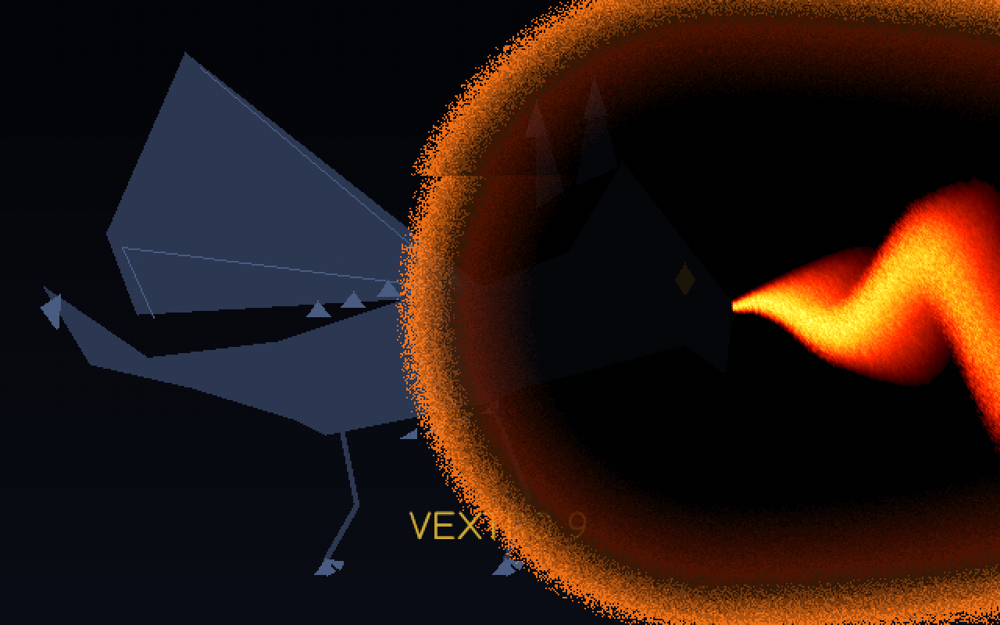
</p>

**The boot animation is not a video.** The dragon off the desktop wallpaper
draws breath and sets fire to the screen, the screen burns away, and then you
log in. It is the same dragon — `wall_dragon()` takes a centre and a scale, so
the wallpaper draws it full size and the boot draws it half size and left of
centre, from one set of polygons.

Two fields do the work, deliberately different mechanisms because they are
different things. **The fire is advected**: each cell pulls heat from the cell
to its left and the ones below, so the flame streams away from the mouth and
rises. **The burn is a front**: fire is not what destroys the screen, what
fire leaves behind is, so the char is a separate field that ignites where the
jet lands and eats outward on its own, ember rim ahead of cold char. It
spreads in a distance metric squashed hard downrange — a front that spreads
evenly is a circle, and a circle expanding out of a dragon's mouth reads as a
shockwave rather than as something catching light.

Neither needs a square root. Integer throughout, on the same 360-entry sine
table the login screen uses, because this runs *before* the floating-point
unit is switched on — before the interrupt table exists, before a single
driver has been probed.

It used to be a recording, and recordings are heavy: 121 frames of 320×240
RGB565 is **18.5 MB of raw pixels**, linked into the kernel *and* copied into
the ISO, generated from a 6.8 MB `.mp4` by ffmpeg.

| | before | after |
|---|---:|---:|
| ISO | 40 MB | **4.6 MB** |
| in the repository | 6.8 MB of video | **none** |
| ffmpeg | required | **not used at all** |

---

# What is built

| | |
|---|---|
| **Kernel** | Four objects behind one seam header; bitmap frame allocator over the firmware map; slab and page-run heap with paged and non-paged pools; per-process PML4 with the kernel half shared by reference |
| **Scheduler** | Preemptive strict-priority round-robin over 64 threads on the APIC timer at 1 kHz; per-thread FPU state through `fxsave64`/`fxrstor64`; `general-regs-only` handlers; sleep, join, block-on-channel and a frame clock |
| **Processes** | Ring 3 with its own GDT and TSS, `SYSCALL`/`SYSRET` and a DPL-3 `int 0x80` gate, W^X on every image, absent page zero, faults that kill a thread instead of the machine |
| **Paging** | Demand paging to a 256 MB contiguous `pagefile.sys` resolved to one raw extent at boot; clock replacement over a frame-to-mapping reverse map; swap slot recorded in bit 10 of the non-present PTE; user pages only |
| **Filesystem** | **NTFS, read and write — the boot volume** — `$MFT` record allocation, `$Bitmap` first-fit clusters, signed-delta run lists, `$INDEX_ROOT` insert and remove, path resolution, directory enumeration, ranged reads, `$UsnJrnl` v2 records and a write-ahead redo journal replayed on mount. exFAT and FAT32 still mount as secondary volumes; ustar ramdisk, GPT and MBR, 8.3 short names, ACLs and SIDs, share modes, change notification |
| **Storage** | NVMe, AHCI/SATA, ATA PIO and USB mass storage behind one 512-byte sector view; physical-contiguity resolution and 4K-block read-modify-write |
| **Network** | lwIP 2.2.1 — IPv4, ARP, ICMP, UDP, DHCP, DNS and a real TCP with reassembly, backoff, window scaling and delayed ACKs — behind the sockets API, eight simultaneous connections. Stateful firewall with connection tracking, NAT, NTP, Intel e1000 |
| **Wireless** | 802.11 frame layer and a complete WPA2 supplicant: PBKDF2 PMK, the 4-way handshake, PTK/GTK derivation, RFC 3394 key wrap and CCMP — all checked against published vectors. Intel and Realtek PCIe back-ends do the probe, reset, APM sequence, DMA rings and firmware-load protocol *(see the caveat below)* |
| **Transport security** | Mbed TLS 3.6.4 stripped to TLS 1.3, allocating through the kernel heap, seeded from RDRAND, eight parallel sessions — and **certificates are verified**: `VERIFY_REQUIRED`, hostname checked, **87 of 128 roots** parsed from `/etc/ca-bundle.crt`. The other 41 are exactly the roots signed `sha1WithRSAEncryption`, and they stay unreadable on purpose — SHA-1 signatures have been forgeable since 2017, so refusing them is the feature rather than the gap |
| **Remote desktop** | RDP server on port 3389: X.224, MCS domain and channel binding, licensing, capability exchange, compositor damage encoded as bitmap updates, input decoded into the system task queue *(plaintext — see below)* |
| **Directory** | LDAP v3: simple bind, subtree search with equality and presence filters, BER written by hand and parsed with a bounded reader that refuses the indefinite-length form |
| **Domain auth** | Kerberos v5 — AS exchange with PA-ENC-TIMESTAMP, TGS exchange, AP-REQ; aes256-cts-hmac-sha1-96 and aes128-cts, and deliberately **not** rc4-hmac, which is what makes Kerberoasting work. RFC 3961 n-fold, DK and string-to-key against the RFCs' own vectors. Tickets survive a reboot, encrypted under a key derived from the login password |
| **File sharing** | SMB2 dialects 2.0.2, 2.1 and **3.0** — every message signed by HMAC-SHA256, or AES-128-CMAC and whole-message AES-128-CCM encryption at 3.0, with the transform header as associated data so a frame retargeted at another session fails its tag. NTLMv2 over NTLMSSP inside SPNEGO. SMB1 is absent *by construction* — the code to speak it does not exist, so the connection cannot be talked down to it |
| **Group Policy** | Machine policy fetched from SYSVOL over SMB2 and applied through the registry; GPT.INI version parsing and Registry.pol in PReg format, validated whole before a single value is written, inside one registry transaction |
| **Windows layer** | PE/PE32+ loader with base relocations, import binding and per-section protections; structured exception handling — `__try`/`__except` dispatched from the trap handler through `.pdata`/`.xdata`; TEB and PEB through GS; `.rsrc` strings; a registry with typed values and transactional commit; Microsoft-ABI trampolines preserving the twelve registers System V does not |
| **Virtualisation** | AMD-V: VMCB, nested paging, a 32-bit guest that runs on the processor. Intel VT-x: VMXON/VMCS/VMWRITE, capability-MSR control negotiation, EPT in its own entry format, and a **64-bit long-mode guest** with its own page tables *(see below)* |
| **Media** | H.264 bitstream parser, Gen9 MFX command builders and VEBOX/CPU colour conversion writing NV12→BGRA **straight into a ring-3 window's mapped pixels** — no copy, no syscall in the path. FLAC, IMA ADPCM and G.711, all integer |
| **Graphics** | TrueType rasteriser with adaptive curve flattening and exact-area coverage; a full **bytecode hinting interpreter** — font program, pre-program and per-glyph instructions actually executed, 26.6 fixed point throughout; alpha-blended shadows with radial corners, spring-driven window motion, Gen9 blitter with hang capture, firmware framebuffer fallback |
| **3D** | `g3d`: pipelines, vertex and index buffers, matrices, a command buffer — and **G3SL**, a shader language with a tokeniser, precedence parser, static type checker and stack machine, compiled from text at run time. Integer software rasteriser underneath: 16.16 fixed point, perspective divide once per vertex, 1/z depth buffer, backface culling |
| **Compression** | Zstandard (RFC 8878) and LZMA/LZMA2/xz, both written from the specifications; ZIM archive reader that never loads a cluster it does not need |
| **Inference** | GGUF parsing, byte-level BPE tokeniser, dequantisation for every weight type used, transformer forward pass — two models resident at once, checking each other |
| **Security** | Ring 3 isolation (above); ChaCha20 against RFC 8439 vectors; encrypted containers with a passphrase verifier; encrypted backup and restore; per-account allowlist; **Aho-Corasick signature scanner**; UAC prompt levels |
| **Accounts** | Multiple users, salted SHA-256 iterated 4,096 times compared in constant time, per-user home directories and profile trees, administrator rights, logout that clears session state |
| **Firmware** | ACPI: RSDP through XSDT, MADT, FADT, HPET and MCFG, every checksum checked; CPU topology from CPUID leaf 0x0B; microcode revision read and updates applied |
| **Applications** | Terminal (161 commands), browser, file manager, offline Wikipedia with chat, image viewer, paint, system monitor, app store, calculator, media player, 3D viewer, CHIP-8, hypervisor console, settings |
| **Userland** | `.vx` container format, two syscall ABIs, a C library of its own — libm, pthreads, `mmap`, file descriptors, BSD sockets, `FILE` streams and the `scanf` family — a freestanding C++ runtime over it, a package store, five shipped apps |
| **Boot** | Limine, BIOS *and* UEFI, El Torito ISO; an animation the kernel computes rather than plays back |

### The scanner is an automaton

The signature scanner used to search the buffer **once per signature**. It is
now **Aho-Corasick**: the signatures compile into a deterministic automaton and
matching is one table lookup per input byte, *independent of how many
signatures there are*. A hundred cost what two cost, so adding to the table no
longer costs anything at launch time.

Both matchers are kept — the direct search is the fallback if the node pool
overflows, and it is what `tools/av_test.c` compares against over **20,000
generated buffers**, including near-misses like `X5O!X5O!P%@AP…` which is
exactly where a trie without failure links breaks. One subtlety preserved
deliberately: the old loop reported by *table* order and an automaton finds
*buffer* order, so the scan collects the lowest index across the whole pass
rather than stopping at the first hit. The same signature is named as before,
every time.

---

# Verification

`make test` runs **3,677,813 checks across 15 suites** on the host, every build.
The bar is not "it agrees with itself" — an implementation that is merely
self-consistent round-trips perfectly and proves nothing:

| suite | what it proves |
|---|---|
| `ntcrypto`, `aes`, `krb5` | AES against FIPS-197, RFC 3961 n-fold/DK/string-to-key against the RFCs' own vectors, AESENC and the portable path made to agree |
| `wifi` | PMK against IEEE 802.11i's passphrase vectors, key wrap against RFC 3394, CCMP against RFC 3610, the 4-way handshake against a synthetic authenticator |
| `ntfs` | 193 checks against scratch volumes — run-list encoder against the *decoder*, path resolution including the paths that must *fail*, ranged reads at cluster boundaries and past end-of-file, a 2,000-name B-tree at depth three, separator deletion, every mutation followed by a fresh mount, and the journal replayed against a deliberately interrupted write |
| `av` | the automaton against the brute-force search it replaced, over 20,000 buffers, under ASan and UBSan |
| `vmx` | EPT entry format, capability-MSR negotiation, VMCS field encodings decoded against their width/type structure |
| `media`, `rdp` | bitstream parsing and surface geometry; RDP wire encoders against the bytes the specification prescribes |
| `crypto`, `mbedtls` | ChaCha20/X25519/HKDF against RFC 7748, 8439 and 5869; a real TLS 1.3 handshake when a server is given |
| `ttfhint`, `wikidoc`, `profile` | grid-fitting measured rather than claimed; layout and profile round-trips |

Three checks run **in the kernel**, because they cannot run anywhere else:
`crypto_switch_selftest` proves XMM survives preemption across 182 real
context switches; the AES selftest is the only place AESENC and the portable
implementation both exist; and the loader is **fuzzed** rather than trusted —
`vx_validate()` under AFL++ and AddressSanitizer, last run **33,644
executions, 71.2% edge coverage, 100% stability, zero crashes**.

---

# Written, but not exercised on hardware

Stated separately because the distinction is invisible from the code, and
because a repository that blurs it is not worth reading.

| | what runs | what does not |
|---|---|---|
| **Wi-Fi / WPA2** | The frame layer and the whole WPA2 engine, verified against published vectors on every build. The PCIe probe, BAR mapping, device reset, APM power sequence, DMA rings and firmware-load protocol are real register programming. | Both Intel iwlwifi-class and Realtek PCIe parts are **firmware-driven**: the silicon has no usable MAC until a signed microcode image is DMA'd in and booted through an ALIVE handshake, and scanning and association are firmware commands rather than register writes. That image is a proprietary blob, is not in this tree, and cannot be written from the specification. Without it the driver probes, resets, maps, then stops at `WIFI_STATE_NO_FIRMWARE` and says so. QEMU also emulates no wireless device at all. |
| **Hardware video decode** | The H.264 bitstream parser, surface geometry and colour conversion, all host-verified. The zero-copy design is the substance: the decoder's output surface *is* the window, because the same physical pages are in both the process's page tables and the GPU's GGTT. | **No machine this is built or tested on has an Intel GPU.** QEMU models none, so `igpu_init()` reports "no Intel display controller" and everything from the VCS ring downward is unreachable. The MFX command encodings come from Intel's public documentation; they have not touched silicon, and a misplaced field would show up as an engine hang only hardware can reveal. |
| **Intel VT-x** | The arithmetic those instructions consume: EPT entry format, control negotiation against the capability MSRs, VMCS field encodings, the long-mode guest's own page tables. 46 host checks. | `query-cpu-model-expansion max` on this QEMU reports **`vmx = False`**, so no `VMXON` or `VMLAUNCH` here has executed or can be made to. It also stops short of `VMLAUNCH` deliberately — entering a guest with no host-resume stub would be worse than not entering one. `vmx_init()` reports *"no VT-x on this processor"* and stays out of the way; the AMD path still says `ready`. |
| **RDP** | This one *does* run — it is software over TCP and the stack is up in QEMU. `tools/rdp_probe.py` drives a real connection through all eight handshake stages from the host. | The session is **plaintext**: it negotiates `PROTOCOL_RDP` with `ENCRYPTION_METHOD_NONE`, which is legal and real clients support it, but keystrokes, the login password and the screen contents are in the clear, and there is no server authentication. `rdp_is_encrypted()` returns 0 and the terminal says so before anyone starts the service. Sustained bitmap streaming is not proven — the encoders are correct and unit-tested, but long sessions have stalled on this transport and that has not been root-caused. |

## Not implemented

| | Why not |
|---|---|
| **Hardware-rasterised 3D, and OpenGL** | There *is* a 3D API with a real shader compiler. What no hardware here can do is run it: the Gen9 driver is a blitter by design and QEMU's display has no 3D engine, so geometry and fragment stages are CPU work. **libepoxy is ported** and WebKit's configure finds it — it is a function-pointer dispatcher, so it builds without an OpenGL underneath — and nine entry points resolve to the framebuffer at `/dev/dri/renderD128`: clear, viewport, read pixels, and the strings a stack reads to find out what it is talking to. Everything with a pipeline behind it is absent from the table, so `glDrawArrays` prints its own name and aborts rather than drawing nothing. A software GL over the existing rasteriser is the rung that changes that. |
| **Terminals, sessions, process groups** | All four of the things this table used to list — signals, `exec`, `dup`, pipes — are built. What is still absent is the layer above them: there is one console, it belongs to the compositor's window rather than to any process, and `setsid` answers ENOSYS because there is no structure for a session to partition. `kill` refuses the negative pids that name a group for the same reason. `dup` also arrived with its limits stated instead of hidden: here a descriptor *is* the open file description, so a file open for writing or a connected socket cannot be duplicated — two write-back images or two closes of one connection are each wrong in a way a program meets as data loss — and both are refused by name. |
| **Full-disk encryption** | Individual directories seal into encrypted containers; the volume itself is not encrypted, so filenames and free space are in the clear. |
| **Sandboxing beyond ring 3** | Hardware isolation is real now — a program cannot read the kernel or another process. What is still only *policy* is which programs may start: the allowlist and scanner decide that, and nothing constrains what a program does within its own address space. |
| **VPN, branch caching, SMB Direct** | Not written. Kerberos also holds tickets encrypted on disk rather than in a kernel keyring. |
| **Biometrics, multi-touch, TV tuners** | No hardware to drive in this configuration, and no streaming protocol. |

---

# Things that are more interesting than they sound

### A language model, on the metal

`src/llm.c` is a complete transformer: byte-level BPE tokeniser, GGUF parsing,
dequantisation for every weight type the model uses, and the forward pass.

<p align="center">
  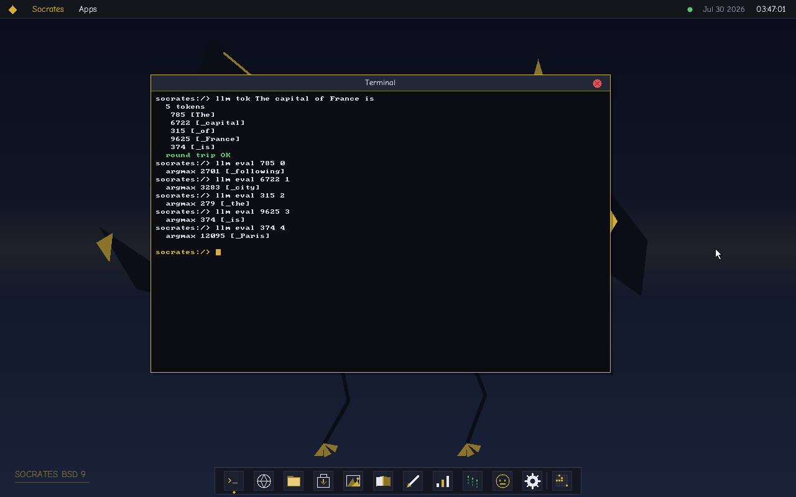
</p>

The prediction sharpens as context arrives — `The` → ` following`,
`The capital` → ` city`, `The capital of France` → ` is`, and then **` Paris`**.
That is a real forward pass, not a lookup: 24 layers, 14 query heads over 2
key/value heads, a 151,936-token vocabulary, 373 MB of weights resident, on a
machine with no libc and no GPU.

<p align="center">
  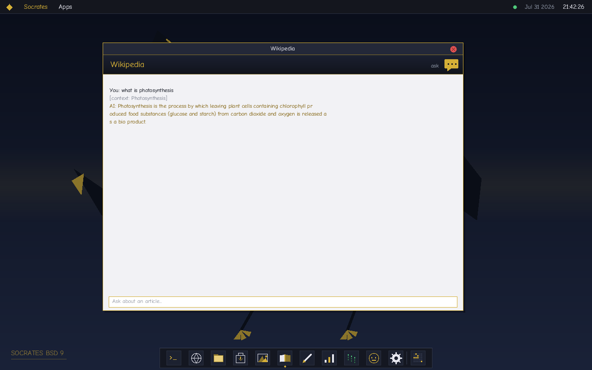
</p>

Asked *what is photosynthesis*, it pulled the distinctive words out of the
question, binary-searched 399,853 sorted titles, read
`[context: Photosynthesis]` off a 980 MB archive, and answered from that
article — retrieval-augmented generation with no index, no database and no
network. The wording is the model's own, mangled grammar and all; tidying it
up here would misrepresent it. The model loads **by itself, in the
background**, while the desktop stays live.

That check exists because of a bug worth recording. The model answered fluent
nonsense for a long time, and the suspicion was on K-quant dequantisation —
which this model does not use at all. Three of its tensors are **Q5_1**,
`quant_block` knew the type so the file loaded cleanly, and `dequant_block`
had no case for it, so every such block returned −1 and the matmul quietly
returned zero. All three are `ffn_down`, in layers 0, 1 and 10. Layer 0
corrupts the residual stream before anything else runs, which is exactly how
you get logits carrying no signal. **Two tables disagreeing about which
formats exist** was the whole defect; a missing type now fails loudly at load
rather than silently at inference.

### A model trained here, to answer only from the archive

`assets/explain.gguf` is 135M parameters, fine-tuned in this repository on
42,495 examples built out of the encyclopedia itself. Nothing in the target
text is invented, by construction — a dataset written by a larger model would
teach this one to sound like that model, including when it is wrong.

Not trained from scratch, and the arithmetic is why. A 200M model wants roughly
four billion tokens to be worth its size; Simple English Wikipedia is about
three hundred million. That produces a model *weaker* than the 0.5B it was
meant to improve on.

A fifth of the set is **refusals** — a question whose passage does not answer
it, with "Not in the archive." as the target. Without them a small model learns
that an answer is always available and produces one from nowhere.

| | grounded | refusal correct | token-F1 |
|---|---:|---:|---:|
| SmolLM2-135M, as downloaded | 35.0% | 26.1% | 0.318 |
| **fine-tuned here** | **77.0%** | **100.0%** | **0.993** |

> **base** — "Don Sandburg was an American television writer, actor and producer. *He died at the age of 87.*" — the death invented
>
> **tuned** — "Don Sandburg (1930 – October 6, 2018) was an American television writer, actor, and producer."

Running it needed one real fix. Rotary embeddings pair each dimension with a
partner, and there are two incompatible conventions: half-split (`i` with
`i + head_dim/2`, which qwen2 uses in GGUF) and interleaved (`2i` with `2i+1`,
which llama uses, because llama.cpp permutes the q and k weights for it).
Choosing wrong leaves attention working and the text fluent **while the numbers
are wrong**. It surfaced by running the kernel's own transformer on the host
and finding the q projection to be the reference's values at every other
position. With the convention selected by architecture, every logit matches to
three decimals.

### Both models, at once, checking each other

Both are resident together — `llm.c` keeps everything belonging to *a* model in
one struct and there are two of them, so switching is an index rather than a
reload. A question goes to both; the 0.5B answers the same prompt re-encoded,
because its tokenizer is a different vocabulary entirely. Then a deterministic
verifier checks each against the entry:

```
AI: Gravity, or gravitation is one of the fundamental forces of the
    universe. It is an attraction, or pull, between any two objects
    with mass.
(1 unsupported sentence dropped)
Checked twice: a second reading of the same entry agreed on 58% of
    the same facts.
```

The 0.5B wrote "it keeps planets in orbit around their stars" — plausible,
absent from the passage, and dropped by the verifier rather than by the other
model. Agreement is not proof, because both can be wrong about the same
passage; **disagreement is the useful signal**, and it is reported rather than
resolved silently.

### A guest that runs on the processor

`src/hyper.h` is a type-1 hypervisor on AMD-V. Not an interpreter: the guest's
instructions execute natively and only what the host intercepts traps back —
CPUID, I/O, MSR access, HLT and the hypercall. AMD-V rather than VT-x for a
checkable reason:

```
query-cpu-model-expansion max  ->  svm = True, npt = True, vmx = False
```

Every exit address in Chamber's log matches the disassembly: `VMMCALL` at
`0x1023`, `CPUID` at `0x1030`, `IOIO` at `0x104F` carrying port `0x3F8` in
`EXITINFO1`. NRIP-save is absent under TCG, so exits advance the instruction
pointer by known lengths and use the processor's next-RIP where it provides one.

`src/hyper_intel.h` is the Intel path beside it, and the two barely overlap: a
VMCB is a struct you assign to, a VMCS is opaque and every field goes through
`VMWRITE`, and Intel's controls must be **negotiated** against capability MSRs
saying which bits must be 1 and which may be. **EPT entries are not page-table
entries** — no present bit, read/write/execute in bits 0–2, and a write-back
memory type required on leaves. Leaving those zero selects uncacheable, which
is legal, boots, and runs the guest about a hundred times slower: a bug that
reads as "virtualisation is slow" rather than as a defect. Its guest is 64-bit,
and long mode has no unpaged form, so there are **two** levels of translation —
guest page tables and EPT, four levels each, different formats, both walked by
the processor.

### A decoder you can check exactly

`src/flac.h` decodes FLAC: constant, verbatim, fixed and LPC subframes, Rice
partitions with both parameter widths and the raw escape, all four channel
decorrelations, 8/16/24 bits, CRC-8 on each frame header and CRC-16 on each
frame. Integer end to end, which is what makes it exactly checkable — the
samples that come back are the samples that went in, not the samples that went
in to within a rounding error.

That caught a real bug: the Rice partitioning is defined over the whole block,
not over the residual. Sizing it over the residual is invisible at partition
order 0, which is what short frames use, and only appears once an encoder picks
a real partition order.

### Type, without a font library

`src/ttf.h` is a TrueType rasteriser with no font library under it — glyph
outlines, quadratic Béziers, anti-aliasing, no GPU. Baselines snap to whole
pixels (leave them fractional and a 13px baseline lands on a half-pixel and
fringes every letter), and each glyph's coverage mask is cached per size.

`src/ttfhint.h` is the bytecode interpreter above it: the font program, the
pre-program and every glyph's own instructions, **executed rather than
skipped** — stack machine with functions, control flow, storage, the twilight
zone, the control value table and delta exceptions, 26.6 fixed point
throughout. Grid-fitting is measured rather than claimed: on-curve coordinates
land on a whole pixel boundary 1% of the time unscaled and **18% hinted**, and
at 11 px the three bars of an 'E' go from smeared across two rows each to one
solid row each.

### Its own executable format

Store packages are `.vx` images: an 80-byte header, page-separated text and
data, no relocations. The same `vx_validate()` runs in the host packer, the
kernel loader and the store's download path — one validator, three consumers,
so a payload cannot be accepted by one and rejected by another.
`vxfmt/vx_run.c` is a POSIX loader for the same format, so an image can be
checked on your laptop before the kernel ever sees it. Text and data never
share a page, so `mprotect()` can give them different protections and **W^X
holds**; on hosts with pages coarser than 4 KB it refuses rather than silently
mapping RWX.

---

# Source layout

```
include/
  kernel_shared.h   The seam: everything that crosses an object boundary
src/
  core/main.c       Entry point, boot, hardware init, render loop, login
  sched/            scheduler.c  threads, the 1 kHz ISR, the switch
                    sched.h      thread_t, priorities, the inline hot path
                    vls_core.c   the Linux ABI: router, signals, wait4
  fs/ntfs/          ntfs_ops.c   NTFS read + write, $MFT, journal
  security/         anti_virus.c Aho-Corasick scanner, allowlist, UAC
  net/              wifi.c  ieee80211.h  wpa2.h   802.11 + WPA2 supplicant
                    rdp.c   rdpwire.h            RDP server + wire encoders
  media/            decode.c h264.h mfx.h csc.h  H.264 → GPU → window pixels

  --- memory and protection ---
  pmm.h  vmm.h  kheap.h  swap.h    frames, page tables, heap, pagefile
  gdt.h  idt.h  apic.h  trap.h     descriptors, vectors, the local APIC
  syscall.h  winproc.h  pe.h       two ABIs, PE loading, SEH
  vls.h (include/)  devfs.h        the Linux subset, and /dev

  --- storage and filesystems ---
  blk.h  nvme.h  ahci.h  ata.h  usbmsc.h   one sector view, four buses
  exfat.h  fat32.h  part.h  fsmeta.h       volumes, partitions, metadata
  registry.h  users.h  profile.h           hives, accounts, profile trees

  --- network and security ---
  netstack.h  netx.h  e1000.h  vxport.h    IPv4/TCP, firewall, NIC, seam
  tls.h  ntcrypto.h  aes.h  sha256.h  chacha20.h
  ldap.h  kerberos.h  krb5crypto.h  ntlmssp.h  smb2.h  gpo.h  ber.h
  security.h                               vault, tar writer

  --- graphics, audio, compute ---
  gfx.h  ttf.h  ttfhint.h  font.h          drawing, type, hinting
  igpu.h  g3d.h  solid.h                   Gen9 blitter, 3D API, G3SL
  hda.h  ac97.h  audio.h  flac.h  adpcm.h  codecs and the mixer
  hyper.h  hyper_intel.h  chamber.h        AMD-V, VT-x, the console
  llm.h llm.c                              transformer inference
  zim.h  zstd.h  lzma.h  sci.h             archives and compression

  --- the desktop ---
  desktop.h  term.h  browser.h  apps.h  store.h  media.h  calc.h  chip8.h
  bootanim.h  login.h  coreutils.h  shell.h  wikidoc.h
  vfs.h                                    descriptors, files, sockets

libc/           The C library ring 3 links against: libm, pthreads over
                the kernel's futex, mmap, descriptors, BSD sockets, FILE
                streams, printf and scanf
libcxx/         A freestanding C++ runtime over it — operator new, the
                __cxa_* the compiler calls by name, and 28 headers
vxfmt/          The .vx format, its packer, a POSIX loader, an AFL harness
apps/           Userland source, store packages, seed files, pictures
tools/          Formatters, test suites, an LDAP server, a KDC, an SMB
                server, an RDP probe — every protocol proved against an
                independently written peer
third_party/    lwIP 2.2.1, Mbed TLS 3.6.4 and libwpe 1.16.2,
                vendored unmodified, plus the ports onto them
```

Underneath the network sit two libraries **not** written here: lwIP 2.2.1 and
Mbed TLS 3.6.4, **230,081 lines vendored unmodified** at their release tags,
reached through a 1,180-line port — the `sys_arch` layer on this scheduler, the
netif on the e1000, the platform hooks on the kernel heap. That port is ours;
the 230,081 lines are not, and the counts are kept apart on purpose.

---

# Try it

```
open browser                    or click the globe in the dock
store install mandel            then look at the dock, and reboot
ping 10.0.2.2
fetch https://example.com       TLS 1.3, chain verified
echo hello disk > hi.txt
mkdir projects && cp hi.txt projects/copy.txt
cat projects/copy.txt           still there after a reboot
```

**Just move the mouse.** The pointer is absolute — no click-to-grab, no capture
to escape. A PS/2 mouse can only report *relative* motion, which a host cannot
turn into a position without capturing the real cursor, so the guest asks for
the VMware backdoor pointer and falls back to PS/2 only when there is no
hypervisor to ask.

<details>
<summary><b>Build options</b></summary>

```sh
make run RES=1920x1080x32   # display mode, up to the back buffer's bound
make run NATIVE=1           # render at the panel's own resolution
make cleandisk              # reset disk.img to factory contents
make test                   # 3.7M host checks
make repo                   # serve the package repository on :8000
```

`make clean` removes build products and the ISO. It deliberately does **not**
touch `disk.img` — the asset stamp lives outside `build/` precisely so that a
clean rebuild of the kernel cannot cost you your account and your files.

`disk.img` is a standard image — mount it on your host to exchange files,
including dropping in a multi-gigabyte archive:

```sh
hdiutil attach -imagekey diskimage-class=CRawDiskImage disk.img   # macOS
```

</details>

<details>
<summary><b>Serving the package repository</b></summary>

`make repo` stages and serves the compiled packages on port 8000. QEMU maps the
host to `10.0.2.2`, which is the store's default repository URL, so **Refresh**
just works — it picks up `voronoi`, deliberately *not* on the disk, and
installing it downloads the payload over the kernel's own TCP stack. Point it
elsewhere with `store repo <url>`.

</details>

---

## License

Source released under the [Apache License 2.0](LICENSE).
Comic Neue is under the [SIL Open Font License 1.1](assets/OFL.txt).
Limine is [BSD 2-Clause](https://github.com/limine-bootloader/limine).

<p align="center"><sub>An <a href="https://github.com/mrcalmtuber/vextro-arm64">aarch64 port</a> exists and runs under hardware virtualisation on Apple silicon. This repository is the x86_64 system.</sub></p>
